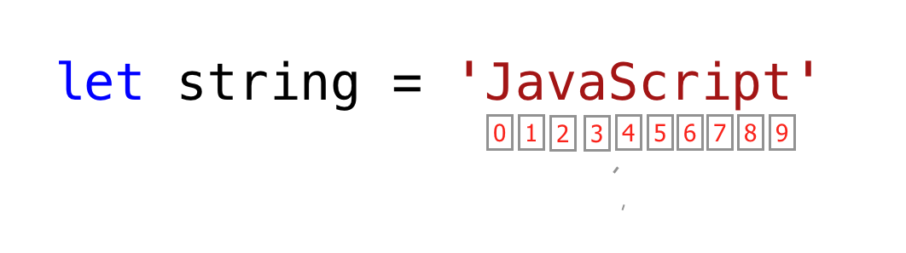

# HIT15-WEB-PRIVATE-2024 - WEEK 10

---

## [Home](../README.html)

---

## Nội dung

## [I. Đôi chút về Javascript](#i-đôi-chút-về-javascript)

## [II. Các kiểu dữ liệu trong Javascript](#ii-các-kiểu-dữ-liệu-trong-javascript)

## [III. Biến và khai báo biến](#iii-biến-và-từ-khóa-khai-báo-let-const-var)

## [IV. Hoisting và Scope](#iv-hoisting-và-scope)

## [V. String và Template Literals](#v-string-và-template-literals)

## [VI. Toán tử (Operators)](#vi-toán-tử-operators)

## [VII. Cấu trúc điều kiện: if-else, switch case](#vii-cấu-trúc-điều-kiện-if-else-switch-case)

## [VIII. Vòng lặp: for, while](#viii-vòng-lặp-for-while)

---

## I. Đôi chút về Javascript

#### 1. Phần đuổi mở rộng của file Javascript là `.js`

#### 2. Đoạn mã Javascript đặt ở đâu?

- Các đoạn mã đặt trong thẻ `script` trong phần `body`

```html
<!DOCTYPE html>
<html lang="en">
  <head>
    <meta charset="UTF-8" />
    <meta name="viewport" content="width=device-width, initial-scale=1.0" />
    <title>Document</title>
  </head>
  <body>
    <h1>Hello, World!</h1>

    <script>
      console.log("Hello world~");
    </script>
  </body>
</html>
```

- Nếu là 1 file chứa các đoạn mã Javascript

```html
<!DOCTYPE html>
<html lang="en">
  <head>
    <meta charset="UTF-8" />
    <meta name="viewport" content="width=device-width, initial-scale=1.0" />
    <title>Document</title>
  </head>
  <body>
    <h1>Hello, World!</h1>

    <!-- Liên kết file JavaScript -->
    <script src="js/app.js"></script>
  </body>
</html>
```

!!! :: Lưu ý: Thẻ `script` nên đặt ở cuối file `html`, trong `body` hoặc dưới `body`

> ❓ Tại sao nên link Javascript trong thẻ head hoặc body của HTML?
> Việc link JavaScript trong phần head hoặc body của HTML có ảnh hưởng đến hiệu suất tải trang. Khi trình duyệt gặp một thẻ script, nó sẽ dừng quá trình tải trang và thực thi mã JavaScript
>
> - Nếu chúng ta đặt thẻ script trong phần head, trình duyệt sẽ phải tải và thực thi mã JavaScript trước khi hiển thị nội dung trang web.
> - Trong khi đó, đặt thẻ script ở cuối phần body giúp trình duyệt tải trang nhanh hơn đảm bảo trình duyệt tải và hiển thị nội dung trang web trước khi thực thi mã JavaScript.

#### 3. Comment trong Javascript

- Chú thích một dòng: sử dụng dấu gạch chéo `//`
  ```javascript
  // Đây là một comment một dòng
  let x = 5; // Biến x được gán giá trị 5
  ```
- Chú thích nhiều dòng: sử dụng dấu `/* */`
  ```javascript
  /* Đây là một comment nhiều dòng
  Chú thích này có thể bao gồm nhiều dòng
  giúp giải thích mã rõ ràng hơn */
  let y = 10;
  ```

---

## **II. Các kiểu dữ liệu trong JavaScript**

#### 1. Kiểu dữ liệu nguyên thủy (Primitive Types):

- **`Number`**: Lưu trữ số nguyên, số thập phân.
  Ví dụ: `10`, `3.14`, `-100`.
- **`String`**: Lưu trữ chuỗi ký tự, đặt trong `' '`, `" "`, hoặc ` `.
  Ví dụ: `"Hello"`, `'World'`, `Hi ${name}`.
- **`Boolean`**: Chỉ có 2 giá trị: true (đúng) hoặc false (sai).
  Ví dụ: true, false.
- **`Undefined`**: Khi biến được khai báo nhưng chưa gán giá trị.
  Ví dụ:
  ```javascript
  let x;
  console.log(x); // undefined
  ```
- **`Null`**: Dùng để gán giá trị "trống" hoặc không có gì.
  Ví dụ:
  ```javascript
  let y = null;
  ```

#### 2. Kiểu dữ liệu không nguyên thủy - tham chiếu (Reference Types):

- **`Object`**: Dùng để lưu trữ dữ liệu phức tạp dưới dạng key-value.
  Ví dụ:
  ```javascript
  let person = { name: "John", age: 25 };
  ```
- **`Array`**: Một danh sách các giá trị.
  Ví dụ:
  ```javascript
  let colors = ["red", "green", "blue"];
  ```
- **`Function`**: Dùng để định nghĩa các hành động.
  Ví dụ:
  ```javascript
  function greet() {
    console.log("Hello!");
  }
  ```

#### 3. So sánh kiểu dữ liệu nguyên thủy và kiểu dữ liệu không nguyên thủy

##### 3.1. Kiểu dữ liệu nguyên thủy

- Kiểu dữ liệu nguyên thủy là kiểu dữ liệu bất biến tức là khi một kiểu dữ liệu nguyên thủy được tạo ra, ta không thể sửa đổi chúng

  ```javascript
  let word = "Hello world";
  ```

  ```javascript
  word[0] = "Y";
  ```

  Nếu chúng ta cố gắng sửa đổi chuỗi được lưu trữ trong word, Javascript sẽ phát sinh lỗi vì biểu thức này không thể thay đổi chuỗi được lưu trữ trong biến `word`

> ❓ **Vậy nếu có 1 biến `num = 10` và tôi vẫn có thể gán lại là `num = 20` thì đâu còn gọi là bất biến?**
> Khi ta thay thay đổi giá trị của biến `num`, ta không thay đổi giá trị nguyên thủy ban đầu mà là đang tạo ra một giá trị mới và làm cho biến `num` trỏ tới giá trị này

- Các kiểu dữ liệu nguyên thủy so sánh với nhau trực tiếp bằng giá trị của nó

  ```javascript
  let numOne = 3;
  let numTwo = 3;

  console.log(numOne == numTwo); // true

  let js = "JavaScript";
  let py = "Python";

  console.log(js == py); //false

  let lightOn = true;
  let lightOff = false;

  console.log(lightOn == lightOff); // false
  ```

##### 3.2. Kiểu dữ liệu không nguyên thủy - tham chiếu

- Các kiểu dữ liệu không nguyên thủy có thể sửa đổi hoặc thay đổi được, tức ta có thể sửa đổi giá trị của các kiểu dữ liệu nguyên thủy khi chúng được tạo

  ```javascript
  let nums = [1, 2, 3];
  nums[0] = 10;

  console.log(nums); // [10, 2, 3]
  ```

- Kiểu dữ liệu nguyên thủy không so sánh bằng giá trị. Ngay cả khi chúng cùng thuộc tính hay giá trị thì cũng không bằng nhau và chúng chỉ bằng nhau khi cùng tham chiếu đến cùng một đối tượng
  **Không bằng nhau**:

  ```javascript
  let nums = [1, 2, 3];
  let numbers = [1, 2, 3];

  console.log(nums == numbers); // false

  let userOne = {
    name: "Asabeneh",
    role: "teaching",
    country: "Finland",
  };

  let userTwo = {
    name: "Asabeneh",
    role: "teaching",
    country: "Finland",
  };

  console.log(userOne == userTwo); // false
  ```

  **Có bằng nhau:**

  ```javascript
  let nums = [1, 2, 3];
  let numbers = nums;

  console.log(nums == numbers); // true

  let userOne = {
    name: "Asabeneh",
    role: "teaching",
    country: "Finland",
  };

  let userTwo = userOne;

  console.log(userOne == userTwo); // true
  ```

##### 3.3. Tổng kết

| **Kiểu dữ liệu**      | **nguyên thủy**              | **không nguyên thủy - tham chiếu**                   |
| --------------------- | ---------------------------- | ---------------------------------------------------- |
| **Khả năng thay đổi** | Bất biến, không thể thay đổi | Có thể thay đổi                                      |
| **So sánh**           | So sánh giá trị              | Không so sánh bằng giá trị (So sánh bằng tham chiếu) |

---

#### 3. Kiểm tra kiểu dữ liệu

Dùng `typeof` để kiểm tra kiểu dữ liệu của biến.

```javascript
let name = "Alice";
console.log(typeof name); // string
let age = 20;
console.log(typeof age); // number
let isHappy = true;
console.log(typeof isHappy); // boolean
```

## **III. Biến và từ khóa khai báo: `let`, `const`, `var`**

#### **1. Bảng so sánh `var`, `let`, `const`**

Dưới đây là bảng so sánh giữa `var`, `let`, và `const` mà không đề cập đến phạm vi (scope) và hoisting:

| **Thuộc tính**        | **`var`**                                | **`let`**                   | **`const`**                 |
| --------------------- | ---------------------------------------- | --------------------------- | --------------------------- |
| **Khả năng thay đổi** | Có thể thay đổi                          | Có thể thay đổi             | Không thể thay đổi          |
| **Khai báo lại biến** | Cho phép khai báo lại trong cùng phạm vi | Không cho phép khai báo lại | Không cho phép khai báo lại |

#### **Ví dụ minh họa:**

```javascript
// var có phạm vi function
if (true) {
  var x = 5;
}
console.log(x); // 5

// let có phạm vi block
if (true) {
  let y = 10;
}
console.log(y); // Lỗi: y is not defined

// const không cho phép thay đổi giá trị
const z = 20;
z = 30; // Lỗi: Assignment to constant variable
```

---

## **IV. Hoisting và Scope**

#### **1. Ví dụ về Hoisting**

Hoisting là cơ chế đưa khai báo biến/hàm lên đầu phạm vi trước khi thực thi.

- Với **`var`**, biến được khởi tạo với giá trị `undefined`.
- Với **`let`/`const`**, biến không thể được truy cập trước khi khai báo.

**Ví dụ:**

```javascript
// Hoisting với var
console.log(a); // undefined
var a = 5;

// Hoisting với let và const
console.log(b); // Lỗi: Cannot access 'b' before initialization
let b = 10;
```

#### **2. Ví dụ về Scope (Phạm vi)**

Phạm vi biến quyết định nơi biến có thể được truy cập.

- **Global Scope**:
  Biến được khai báo ngoài tất cả các khối/hàm.
  ```javascript
  let globalVar = "I am global!";
  console.log(globalVar); // Có thể truy cập ở mọi nơi
  ```
- **Function Scope**:
  Biến chỉ tồn tại trong hàm.
  ```javascript
  function testScope() {
    var localVar = "I am local!";
    console.log(localVar); // Truy cập được
  }
  console.log(localVar); // Lỗi: localVar is not defined
  ```
- **Block Scope**:
  Biến khai báo trong khối `{ }` chỉ tồn tại trong khối đó.
  ```javascript
  if (true) {
    let blockVar = "I am block-scoped!";
    console.log(blockVar); // Truy cập được
  }
  console.log(blockVar); // Lỗi: blockVar is not defined
  ```

Dưới đây là bảng so sánh chi tiết về **Hoisting** và **Scope** giữa `var`, `let`, và `const`:

| **Từ khóa** | **Scope**      | **Hoisting**                                                                       | **Truy cập trước khi khai báo**                                |
| ----------- | -------------- | ---------------------------------------------------------------------------------- | -------------------------------------------------------------- |
| **`var`**   | Function Scope | Được hoisting, giá trị là `undefined`                                              | Có thể truy cập trước khi khai báo nhưng sẽ trả về `undefined` |
| **`let`**   | Block Scope    | Được hoisting nhưng **không thể truy cập trước khi khai báo** (Temporal Dead Zone) | Gặp lỗi nếu truy cập trước khi khai báo                        |
| **`const`** | Block Scope    | Được hoisting nhưng **không thể truy cập trước khi khai báo** (Temporal Dead Zone) | Gặp lỗi nếu truy cập trước khi khai báo                        |

---

## **V. String và Template Literals**

#### **1. Chuỗi**

Là một tập hợp các ký tự được đặc trong dấu nháy đơn hoặc nháy kép, hoặc backtick

```javascript
let str1 = "Hello";
let str2 = "World";
```

#### **2. Nối chuối**

Nối hai hoặc nhiều chuỗi với nhau được gọi là nối chuỗi.

```javascript
let str1 = "Hello";
let str2 = "World";
let space = " ";

let fullStr = str1 + space + str2; // nối hai chuối với nhau
console.log(fullStr); // Hello World
```

#### **3. Chuỗi thoát**

Trong JavaScript và các ngôn ngữ lập trình khác \ theo sau một số ký tự là một chuỗi thoát. Hãy xem các ký tự thoát phổ biến nhất:

- `\n`: new line
- `\t`: Tab, means 8 spaces
- `\\`: Back slash
- `\'`: Single quote (')
- `\"`: Double quote (")

```javascript
console.log("Hello.\nWorld"); // line break
console.log("HIT \tWEB \tPRIVATE");

console.log("This is a backslash  symbol (\\)"); // Để viết một dấu gạch chéo ngược
console.log('In every programming language it starts with "Hello, World!"');
console.log("In every programming language it starts with 'Hello, World!'");
```

#### **4. Độ dài của chuỗi**

Phương thức length trả về độ dài của chuỗi bao gồm không gian trống.

```javascript
let js = "JavaScript";
console.log(js.length); // 10
let firstName = "Asabeneh";
console.log(firstName.length); // 8
```

#### **5. Cách lấy ra một ký tự trong chuỗi (String)**

Bạn có thể sử dụng cú pháp **chỉ số (index)** hoặc phương thức --**`charAt()`** để lấy ra một ký tự trong chuỗi.

Trong lập trình, việc đếm bắt đầu từ 0. Chỉ số đầu tiên của chuỗi bằng 0 và chỉ số cuối cùng là độ dài của chuỗi trừ đi một.



```javascript
let string = "JavaScript";
let firstLetter = string[0];

console.log(firstLetter); // J

let secondLetter = string[1]; // a
let thirdLetter = string[2];
let lastLetter = string[9];

console.log(lastLetter); // t

let lastIndex = string.length - 1;

console.log(lastIndex); // 9
console.log(string[lastIndex]); // t

let message = "Hello, world!";
console.log(message[0]); // "H" (ký tự đầu tiên)
console.log(message.charAt(7)); // "w" (ký tự tại vị trí 7)
```

#### **6. Thay đổi chữ hoa, chữ thường**

- `toUpperCase()`: thay đổi chuỗi thành chữ hoa.

  ```javascript
  let string = "JavaScript";

  console.log(string.toUpperCase()); // JAVASCRIPT

  let firstName = "Asabeneh";

  console.log(firstName.toUpperCase()); // ASABENEH

  let country = "Finland";

  console.log(country.toUpperCase()); // FINLAND
  ```

- `toLowerCase()`: thay đổi chuỗi thành chữ thường

  ```javascript
  let string = "JavasCript";

  console.log(string.toLowerCase()); // javascript

  let firstName = "Asabeneh";

  console.log(firstName.toLowerCase()); // asabeneh

  let country = "Finland";

  console.log(country.toLowerCase()); // finland
  ```

#### **7. Template Literals**

Template Literals (chuỗi mẫu) được giới thiệu từ ES6, giúp chèn biến hoặc biểu thức vào chuỗi bằng cú pháp `${}`.

Cú pháp:

```javascript
//Syntax
const str1 = `String literal text`;
const str2 = `String literal text ${expression}`;
```

```javascript
let name = "John";
let age = 25;
let message = `My name is ${name} and I am ${age} years old.`;
console.log(message); // "My name is John and I am 25 years old."
```

```javascript
console.log(`The sum of 2 and 3 is 5`); // statically writing the data
let a = 2;
let b = 3;
console.log(`The sum of ${a} and ${b} is ${a + b}`); // injecting the data dynamically
```

```javascript
let a = 2;
let b = 3;
console.log(`${a} is greater than ${b}: ${a > b}`);

// 2 is greater than 3: false
```

#### **8. Đổi kiểu dữ liệu**

- Chúng ta có thể đổi từ chuỗi sang số bằng các cách sau:

  - `parseInt(string)`
  - `Number(string)`
  - `Plus sign (+)`

  ```javascript
  let num = "10";
  let numInt = parseInt(num);
  console.log(numInt); // 10
  ```

  ```javascript
  let num = "10";
  let numInt = Number(num);

  console.log(numInt); // 10
  ```

  ```javascript
  let num = "10";
  let numInt = +num;

  console.log(numInt); // 10
  ```

- Chúng ta có thể đổi từ kiểu số thập phân sang số nguyên bằng `parseInt()`

  ```javascript
  let num = 9.81;
  let numInt = parseInt(num);

  console.log(numInt); // 9
  ```

### **VI. Toán tử (Operators)**

#### **1. Các loại toán tử**

- **Arithmetic Operators (Toán tử số học)**: `+`, `-`, `*`, `/`, `%`, `**` (lũy thừa).
- **Assignment Operators (Toán tử gán)**: `=,` `+=`, `-=`, `*=`, `/=`, ...
- **Comparison Operators (Toán tử so sánh)**: `==`, `===`, `!=`, `!==`, `<`, `>`, `<=`, `>=`.
- **Logical Operators (Toán tử logic)**: `&&`, `||`, `!`.
- **Ternary Operator (Toán tử 3 ngôi)**: `condition ? expr1 : expr2`.

#### **2. So sánh `==` và `===`**

| Thuộc tính               | `==` (So sánh lỏng)         | `===` (So sánh nghiêm ngặt)     |
| ------------------------ | --------------------------- | ------------------------------- |
| **So sánh giá trị**      | Có, tự động chuyển đổi kiểu | Có, nhưng không chuyển đổi kiểu |
| **So sánh kiểu dữ liệu** | Không                       | Có                              |

**Ví dụ minh họa:**

```javascript
// So sánh lỏng (==)
console.log(5 == "5"); // true (chuyển "5" thành số 5)
console.log(false == 0); // true

// So sánh nghiêm ngặt (===)
console.log(5 === "5"); // false (khác kiểu dữ liệu)
console.log(false === 0); // false (khác kiểu dữ liệu)
```

**Lời khuyên:** Luôn sử dụng **`===`** để tránh lỗi không mong muốn do chuyển đổi kiểu dữ liệu tự động.

---

## **VII. Cấu trúc điều kiện: `if-else`, `switch case`**

#### 1. **`if / else-if / else`**

**Cú pháp:**

```javascript
if (condition) {
  // Code nếu điều kiện đúng
} else if (anotherCondition) {
  // Code nếu điều kiện khác đúng
} else {
  // Code nếu không điều kiện nào đúng
}
```

**Ví dụ:**

```javascript
let age = 20;
if (age < 15) {
  console.log("Bạn chưa đủ tuổi.");
} else if (age >= 15 && age <= 18) {
  console.log("Bạn vừa đủ tuổi.");
} else {
  console.log("Bạn đủ tuổi.");
}
```

#### 2. `switch case`

**Cú pháp:**

```javascript
switch (expression) {
  case value1:
    // Code
    break;
  case value2:
    // Code
    break;
  default:
  // Code
}
```

**Ví dụ:**

```javascript
let fruit = "apple";
switch (fruit) {
  case "banana":
    console.log("Đây là chuối.");
    break;
  case "apple":
    console.log("Đây là táo.");
    break;
  default:
    console.log("Trái cây không xác định.");
}
```

---

## **VIII. Vòng lặp: `for`, `while`**

#### 1. `for`

```javascript
for (let i = 0; i < 5; i++) {
  console.log(i);
}
```

#### 2. `while`

```javascript
let i = 0;
while (i < 5) {
  console.log(i);
  i++;
}
```

### 3. `do-while`

```javascript
let i = 0;
do {
  console.log(i);
  i++;
} while (i < 5);
```

#### 4. `for of loop`

Nếu bạn không quá quan trọng hay để ý tới giá trị index khi sử dụng đến vòng lặp, bạn có thể sử dụng `for of loop`

```javascript
for (const element of arr) {
  // code goes here
}
```

```javascript
const numbers = [1, 2, 3, 4, 5];

for (const num of numbers) {
  console.log(num);
}

// 1 2 3 4 5

for (const num of numbers) {
  console.log(num * num);
}

// 1 4 9 16 25

// adding all the numbers in the array
let sum = 0;
for (const num of numbers) {
  sum = sum + num;
  // can be also shorten like this, sum += num
  // after this we will use the shorter synthax(+=, -=, *=, /= etc)
}
console.log(sum); // 15

const webTechs = [
  "HTML",
  "CSS",
  "JavaScript",
  "React",
  "Redux",
  "Node",
  "MongoDB",
];

for (const tech of webTechs) {
  console.log(tech.toUpperCase());
}

// HTML CSS JAVASCRIPT REACT NODE MONGODB

for (const tech of webTechs) {
  console.log(tech[0]); // get only the first letter of each element,  H C J R N M
}
```

```javascript
const countries = ["Finland", "Sweden", "Norway", "Denmark", "Iceland"];
const newArr = [];
for (const country of countries) {
  newArr.push(country.toUpperCase());
}

console.log(newArr); // ["FINLAND", "SWEDEN", "NORWAY", "DENMARK", "ICELAND"]
```

#### `5. break`

`break` được sử dụng để dừng vòng lặp

```javascript
for (let i = 0; i <= 5; i++) {
  if (i == 3) {
    break;
  }
  console.log(i);
}

// 0 1 2
```

#### `6. continue`

```javascript
for (let i = 0; i <= 5; i++) {
  if (i == 3) {
    break;
  }
  console.log(i);
}

// 0 1 2
```

---

## **IX. Giới thiệu thêm về `prompt` và `alert`**

1. `prompt()`

- là một hàm trong Javascript dùng để lấy thông tin đầu vào từ người dùng thông qua hộp thoại (dialog box).
- Nó hiển thị một hộp thoại có trường nhập liệu và một nút "OK" để xác nhận. Người dùng có thể nhập thông tin vào trường đó, sau đó thông tin sẽ được lưu trong một biến

  ```javascript
  prompt(message, defaultValue);
  ```

  - `message`: Thông báo hiển thị trong hộp thoại để hướng dẫn người dùng.
  - `defaultValue` (tùy chọn): Giá trị mặc định hiển thị trong ô nhập liệu.

  ```javascript
  let name = prompt("Nhập tên của bạn:");
  alert("Xin chào, " + name + "!");
  ```

2. `alert()`

- `alert()` là một hàm trong JavaScript dùng để hiển thị thông báo (message box) cho người dùng thông qua một hộp thoại đơn giản.
- Nó chỉ hiển thị thông tin và có nút OK để người dùng đóng thông báo.

  ```javascript
  alert(message);
  ```

  - `message`: Thông tin cần hiển thị trong hộp thông báo.

  ```javascript
  alert("Chào mừng bạn đến với JavaScript!");
  ```
