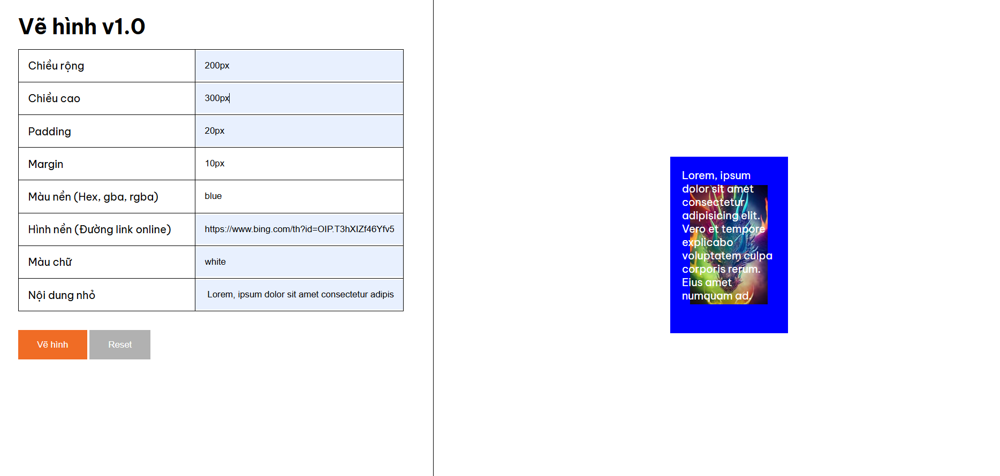
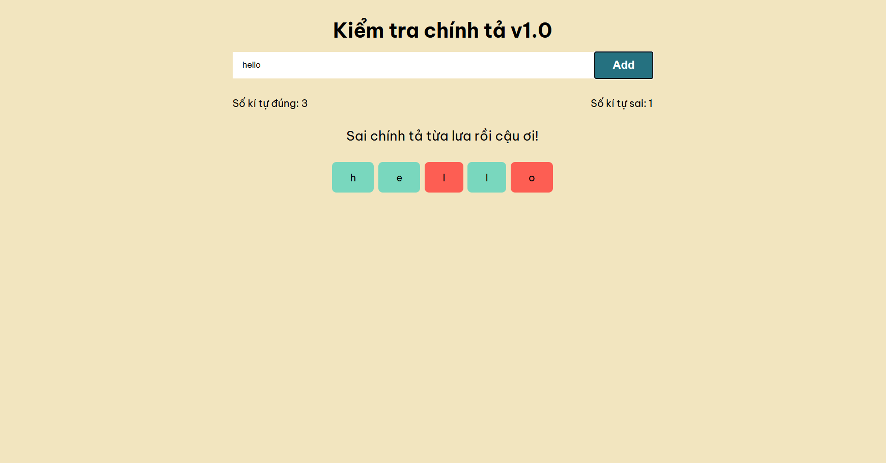

# HIT15-WEB-PRIVATE-2024 - WEEK 11 - BTVN

### Bài 1:

Xây dựng trang web vẽ hình đơn giản phiên bản 1.0. Bạn sẽ nhập vào thông tin như chiều rộng, chiều cao, padding, margin, màu nền, hình nền đơn giản, màu chữ và một đoạn nội dung ngắn

Khi nhấn nút "Vẽ hình", hình mới sẽ xuất hiện với những thuộc tính CSS mà bạn vừa nhập

**Giao diện màn hình:**

**Demo:** [Vẽ hình 1.0](https://hit-15-web-private-2024-btvn.vercel.app/week-11/ex-3/index.html)

### Bài 2:

Nhập vào 1 từ hay một câu tiếng anh ngắn, sau khi nhấn "add" màn hình sẽ hiển thị lần lượt các kí tự trong từ bạn vừa nhập. Gõ lại các kí tự để kiểm tra chính tả. Nếu gõ đúng ký tự sẽ có màu xanh, sai kí tự sẽ có màu đỏ. Khi gõ hết từ sẽ hiển thị thông báo kết quả lên màn hình

**Giao diện màn hình:**

**Demo:** [Kiểm tra chính tả v1.0](https://hit-15-web-private-2024-btvn.vercel.app/week-11/ex-4/index.html)
