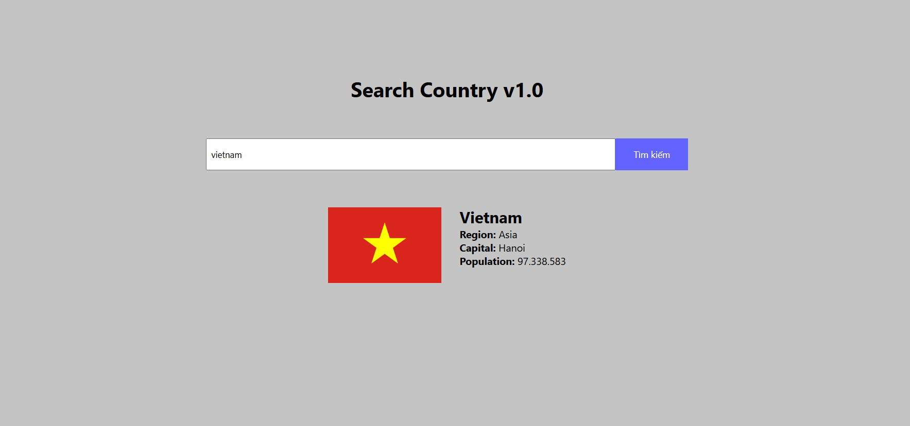
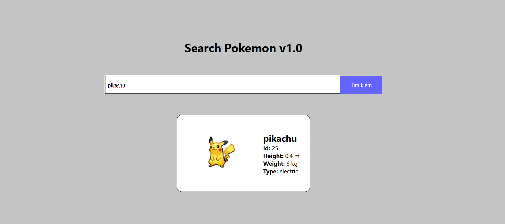

### Bài 1:

- Sử dụng kiến thức Fetch API thực hiện yêu cầu sau của đề bài: Người dùng nhập tên nước, nhấn tìm kiếm và hiển thị một số thông tin của đất nước
- Chú ý: Hiển thị thông báo nếu người dùng không nhập tên nước và không tìm thấy thông tin đất nước đã nhập
- API: https://restcountries.com/v3.1/name/{countryName}
  👉 Thay thế countryName bằng tên đất nước
  Ví dụ: https://restcountries.com/v3.1/name/vietnam
  

👉 **Demo**: [Search Country v1.0](https://hit-15-web-private-2024-btvn.vercel.app/week-16/ex-1/index.html)

### Bài 2:

- Sử dụng kiến thức Fetch API thực hiện yêu cầu sau của đề bài: Người dùng nhập tên pokemon, nhấn tìm kiếm và hiển thị một số thông tin của pokemon đó
- Chú ý: Hiển thị thông báo nếu người dùng không nhập tên pokemon và không tìm thấy thông tin pokemon đã nhập
- API: https://pokeapi.co/api/v2/pokemon/{pokeName}
  👉 Thay thế pokeName bằng tên pokemon
  Ví dụ: https://pokeapi.co/api/v2/pokemon/pikachu

  

👉 **Demo**: [Search Pokemon v1.0](https://hit-15-web-private-2024-btvn.vercel.app/week-16/ex-2/index.html)

### Bài 3:

Cảm thấy 2 bài trên quá giống nhau và đơn giản nên leader quyết định bổ sung thêm bài 3

- API: https://fakestoreapi.com/products

Đây là API sẽ trả về một danh sách các sản phẩm. Nhiệm vụ của bạn là sử dụng fetchAPI để lấy dữ liệu về và hiển thị các sản phẩm này lên màn hình
