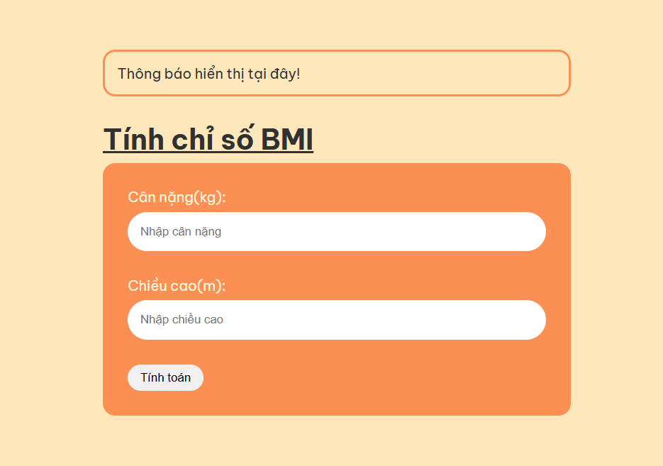
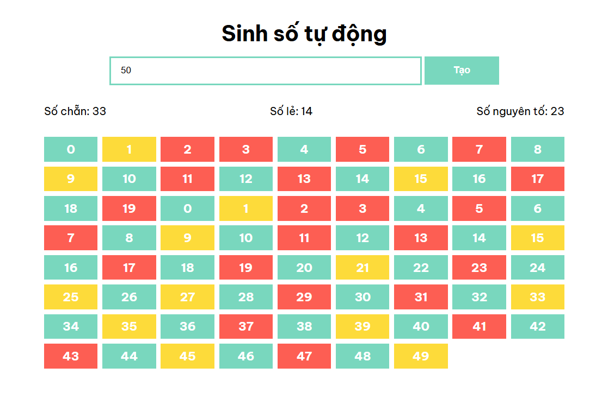

# HIT15-WEB-PRIVATE-2024 - WEEK 11 - BTVN

### Bài 1:

Nhập vào thông tin chiều cao và cân nặng để tính toán chỉ số BMI của 1 cơ thể.
Công thức tính **BMI** (Body Mass Index) là:

\[
\text{BMI} = \frac{\text{Cân nặng (kg)}}{\text{Chiều cao (m)}^2}
\]

- Trong đó:

  - **Cân nặng**: Đơn vị tính là **kilogram (kg)**.
  - **Chiều cao**: Đơn vị tính là **metre (m)**.

- Ví dụ:

  - Nếu một người nặng **70 kg** và cao **1.75 m**, thì:  
    \[
    \text{BMI} = \frac{70}{1.75^2} = \frac{70}{3.0625} ≈ 22.86
    \]

- Phân loại BMI theo tiêu chuẩn của WHO:

1. **Thiếu cân**: BMI < 18.5
2. **Bình thường**: 18.5 ≤ BMI < 24.9
3. **Thừa cân**: 25 ≤ BMI < 29.9
4. **Béo phì độ 1**: 30 ≤ BMI < 34.9
5. **Béo phì độ 2**: 35 ≤ BMI < 39.9
6. **Béo phì độ 3 (Nguy hiểm)**: BMI ≥ 40

Sau đó xử lý các trường hợp của chỉ số BMI như sau và hiển thị kết quả lên màn hình

**Giao diện màn hình:**

**Demo:** [Tính chỉ số BMI](https://hit-15-web-private-2024-btvn.vercel.app/week-11/ex-1/index.html)

### Bài 2:

Nhập vào số lượng số muốn sinh. Hãy xử lý và in ra màn hình tất cả các số cùng số lượng của số chẵn, số lẻ và số nguyên tố. Yều cầu trên màn hình số chẵn có màu xanh (#79d7be), số lẻ màu vàng(#FDDB3A), số nguyên tố màu đỏ(#FD5E53)

**Giao diện màn hình:**

**Demo:** [Sinh số tự động](https://hit-15-web-private-2024-btvn.vercel.app/week-11/ex-2/index.html)
