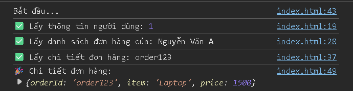
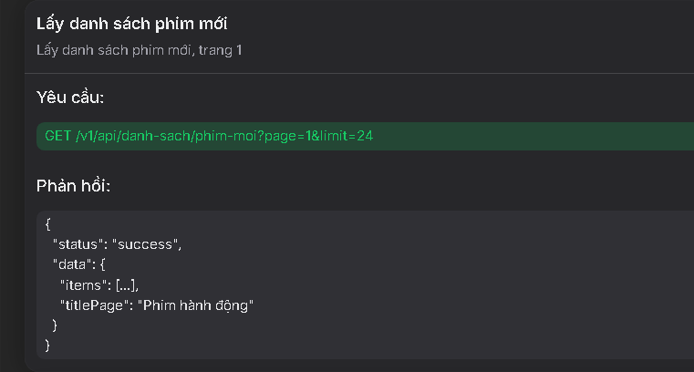
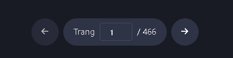
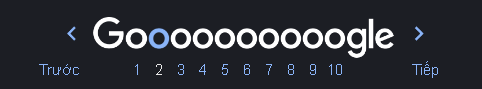

# HIT16-WEB-PRIVATE-2025 - WEEK 16

---

#### [Home](../index.html)

---

#### [I. Promise](#i-promise)

#### [II. Async/Await](#ii-asyncawait)

#### [III. Fetch API](#iii-fetch-api)

---

Trước đây để có thể xử lý các tác vụ bất đồng bộ, Javascript sử dụng tới **callback** để xử lý. Nhưng nếu có quá nhiều tác vụ cần thực hiện tuần tự, chúng ta sẽ gặp phải **callback hell**, đây là một chuỗi các callback lồng nhau làm code khó đọc và khó bảo trì.

Để xử lý các vấn đề còn tồn đọng trên, Javascript cung cấp cho chúng ta **Promise** và **Async/Await** giúp xử lý các tác vụ bất đồng bộ tối ưu hơn

### I. Promise

#### 1. Promise là gì?

**Promise** (lời hứa) là một đối tượng trong Javascript giúp xử lý bất đồng bộ (asynchronous). Nó đại diện cho kết quả của một tác vụ bất đồng bộ. Kết quả này có thể chưa có ngay bây giờ, nhưng sẽ có trong tương lai.

#### 2. Các trạng thái của Promise

**Promise** có 3 trạng thái chính:

- **Pending**: Lời hứa chưa được thực hiện (Promise chưa hoàn thành hoặc thất bại)
- **Fulfilled**: Promise được hoàn thành và trả về kết quả (gọi hàm resolve() )
- **Rejected**: Promise bị lỗi (gọi hàm reject() )

#### 3. Cách tạo và sử dụng Promise

- Cách tạo **Promise**:

  ```js
  const promise = new Promise((resolve, reject) => {
    // Xử lý bất đồng bộ
    let success = true; // Giả định tác vụ thành công

    if (success) {
      resolve("Thành công! 🎉"); // Khi hoàn thành thành công
    } else {
      reject("Lỗi xảy ra! ❌"); // Khi thất bại
    }
  });
  ```

  - resolve(value): Gọi khi thành công.
  - reject(error): Gọi khi thất bại.

- Cách lấy kết quả từ resolve và reject của **Promise** :

  ```js
  promise
    .then((result) => {
      console.log("Kết quả:", result); // Xử lý thành công
      //console log ra Kết quả: Thành công! 🎉
    })
    .catch((error) => {
      console.log("Lỗi:", error); // Xử lý lỗi
      //console log ra Lỗi: Lỗi xảy ra! ❌
    })
    .finally(() => {
      console.log("Hoàn thành! 🚀"); // Dù thành công hay thất bại, vẫn chạy
      //console log ra Hoàn thành! 🚀
    });
  ```

  - .then() → Nhận kết quả khi Promise thành công (resolve)
    - Sau khi nhận kết quả, thường sẽ hiển thị dữ liệu lên màn hình
  - .catch() → Nhận lỗi khi Promise thất bại (reject).
    - Sau khi nhận lỗi, thường thông báo lỗi cho người dùng
  - .finally() → Luôn chạy dù thành công hay thất bại.

#### 4. Promise Chaining

- **Promise Chaining** là cách nối chuỗi nhiều **Promise** để thực hiện các tác vụ tuần tự, trong đó kết quả của bước trước sẽ được truyền sang bước sau
- Mỗi `.then()` sẽ trả về một Promise nên nó cho phép chaining (xâu chuỗi) nhiều `.then()` liên tiếp, nếu không có return trong callback trong `.then()` thì `.then()` tiếp theo sẽ nhận undefined
- .then() chỉ có thể dùng với Promise

```js
function getUser(userId) {
  return new Promise((resolve) => {
    setTimeout(() => {
      console.log("✅ Lấy thông tin người dùng:", userId);
      resolve({ userId, name: "Nguyễn Văn A" });
    }, 1000);
  });
}

function getOrders(user) {
  return new Promise((resolve) => {
    setTimeout(() => {
      console.log("✅ Lấy danh sách đơn hàng của:", user.name);
      resolve(["order123", "order456"]);
    }, 1500);
  });
}

function getOrderDetails(orderId) {
  return new Promise((resolve) => {
    setTimeout(() => {
      console.log("✅ Lấy chi tiết đơn hàng:", orderId);
      resolve({ orderId, item: "Laptop", price: 1500 });
    }, 2000);
  });
}

console.log("Bắt đầu...");

getUser(1) //gọi hàm getUser(1)
  .then((user) => getOrders(user)) // truyền kết quả resolve{ 1, name: "Nguyễn Văn A" } vào biến user
  .then((orders) => getOrderDetails(orders[0])) // truyền kết quả resolve["order123", "order456"] vào biến orders
  .then((orderDetails) => {
    // truyền kết quả resolve{ orderId, item: "Laptop", price: 1500 } vào biến orderDetails
    console.log("🎉 Chi tiết đơn hàng:", orderDetails);
  })
  .catch((error) => console.error("❌ Lỗi:", error));
```



### II. Async/Await

#### 1. Async/Await là gì?

- **async/await** là cú pháp giúp làm việc với Promise dễ dàng hơn
- Nó giúp viết code bất đồng bộ giống như code đồng bộ, dễ đọc hơn
- `async` dùng để khai báo một hàm bất đồng bộ (hàm này luôn trả về Promise)
- `await` dùng để chờ một Promise hoàn thành trước khi tiếp tục

#### 2. Cách hoạt động

##### 2.1. async

- Khi khai báo một hàm với `async` ở trước hàm, nó trả về một **promise**
- Nếu trong hàm có return giá trị, giá trị này sẽ được bọc trong một `Promise.resolve()`

```js
async function getNumber() {
  return 10;
}

console.log(getNumber());
// 👉 Kết quả: Promise { 10 }
// (Vì 10 được bọc trong Promise.resolve(10))
```

- Tương đương với :

```js
function getNumber() {
  // Phải tự dùng Promise.resolve() để bọc giá trị 10
  return Promise.resolve(10);
}

console.log(getNumber());
```

- Tương đương với :

```js
function getNumber() {
  // 1. Tạo một đối tượng Promise mới
  return new Promise((resolve, reject) => {
    resolve(10);
  });
}
console.log(getNumber());
```

- Vì nó trả về một Promise nên chúng ta có thể sử dụng `.then()` để lấy ra kết quả từ promise

##### 2.2. await

- `await` chỉ có thể dùng bên trong một hàm `async`
- `await promise` sẽ tạm dừng hàm `async` và đợi **Promise** hoàn thành, sau đó trả về kết quả của **Promise**

```js
async function getData() {
  let result = await Promise.resolve(20);
  console.log(result); // 👉 20
}

getData();
```

- So sánh với cách viết .then()

```js
function getData() {
  Promise.resolve(20).then((result) => {
    console.log(result); // 👉 20
  });
}
getData();
```

#### 3. Ví dụ:

```js
async function fetchOrderDetails() {
  try {
    let user = await getUser(1); // ⏳ Đợi lấy user
    let orders = await getOrders(user); // ⏳ Đợi lấy orders
    let orderDetails = await getOrderDetails(orders[0]); // ⏳ Đợi lấy chi tiết đơn hàng

    console.log("🎉 Chi tiết đơn hàng:", orderDetails);
  } catch (error) {
    console.error("❌ Lỗi:", error);
  }
}

fetchOrderDetails();
```

### III. Fetch API

#### 1. API là gì?

- Giải thích đơn giản thì **API** giúp cho người làm frontend có thể lấy ra, thêm , thay đổi,... dữ liệu trong cơ sở dữ liệu của server (backend) hoặc thực hiện một số chức năng khác như đăng nhập, ...

- Ví dụ thực tế:
  - Muốn lấy được dữ liệu danh sách phim trong csdl để còn hiển thị lên trang web thì sẽ phải call api từ phía server, khi đó server sẽ trả về một danh sách phim dưới dạng json như trong ảnh.
    
  - User muốn đăng nhập thì , nhập tk mk xong , người làm frontend sẽ phải call api xác thực xem tk mk có tồn tại trong csdl không,..

#### 2. Client và Server là gì?

- **Client** (Máy khách)
  - Là thiết bị hoặc ứng dụng gửi yêu cầu (request) đến máy chủ để lấy dữ liệu
  - Ví dụ: Trình duyệt, ứng dụng di động, ứng dụng desktop
- **Server** (Máy chủ):
  - Là hệ thống xử lý yêu cầu từ Client và gửi phản hồi (response) về
  - Ví dụ: Server của Google, Facebook, Amazon...
- **Mô hình Client-Server** hoạt động như thế nào:
  - Client gửi yêu cầu (Request) đến Server
  - Server nhận và xử lý yêu cầu
  - Server gửi phản hồi (Response) về Client
  - Client hiển thị dữ liệu nhận được
- Ví dụ thực tế
  - Nhập `facebook.com` trên trình duyệt -> Client gửi request (call api bài viết) để lấy các bài viết
  - Server Facebook xử lý yêu cầu và gửi dữ liệu bài viết cho client (gửi phản hồi response)
  - Trình duyệt nhận được dữ liệu của api và hiển thị nội dung các bài viết của Facebook

#### 3. Fetch API

##### 3.1. Fetch API là gì?

- **Fetch API** là một tính năng của Javascript giúp gửi yêu cầu HTTP để lấy hoặc gửi dữ liệu đến một máy chủ
- Hộ trợ các phương thức HTTP: `GET`, `POST`, `PUT`, `PATCH`, `DELETE`,...
- Vì HTTP Request (Gửi và nhận dữ liệu từ server) không thể thực hiện ngay lập tức. Nếu **Fetch API** hoạt động theo kiểu đồng bộ nó sẽ chặn toàn bộ chương trình cho đến khi nhận được phản hồi từ server, từ đó làm trang web bị treo hoặc bị sập
- **Fetch API** sử dụng Promise để tiếp tục thực thi chương trình trong khi chờ dữ liệu phản hồi. Chính vì vậy ta có thể sử dụng `.then()` hoặc async/await để xử lý

##### 3.2. Các phương thức HTTP hỗ trợ

| **Phương thức** | **Chức năng**                    |
| --------------- | -------------------------------- |
| **GET**         | Lấy dữ liệu từ server (mặc định) |
| **POST**        | Gửi dữ liệu lên server           |
| **PUT**         | Cập nhật dữ liệu trên server     |
| **PATCH**       | Cập nhật dữ liệu trên server     |
| **DELETE**      | Xóa dữ liệu trên server          |

##### 3.3. Các thành phần kèm theo khi Fetch API

- **Headers**
  - Headers (Tiêu đề HTTP) chứa các thông tin bổ sung về yêu cầu (request) hoặc phản hồi (response)
  - Giúp server và client hiểu cách xử lý dữ liệu
  - Dùng để xác thực, chỉ định kiểu dữ liệu, định dạng phản hồi
  - Một số Headers phổ biến:
    | **Header** | **Mô tả** |
    | --------------- | -------------------------------- |
    | **Content-Type** | Xác định kiểu dữ liệu gửi đi (JSON, XML, FormData) |
    | **Authorization** | Authorization |
    | **Accept** | Chỉ định kiểu dữ liệu mong muốn từ phản hồi (application/json, text/html) |
    | **User-Agent** | Thông tin về trình duyệt hoặc client gửi yêu cầu |
    | **Cache-Control** | Điều khiển bộ nhớ cache |
    | **Origin** | Chỉ định nguồn gốc của yêu cầu (quan trọng với CORS) |
- **Body**

  - Body là phần nội dung của request, thường dùng trong POST, PUT, PATCH để gửi dữ liệu lên server
  - Một số loại body phổ biến:
    | **Body** | **Mô tả** | **Content-Type**
    | --------------- | -------------------------------- | -------------------------------- |
    | **JSON** | Dữ liệu dạng JSON | `application/json`
    | **Form Data** | Gửi dữ liệu dạng biểu mẫu (upload file) | `multipart/form-data` |
    | **URL Encoded** | Gửi dữ liệu giống như form HTML | `application/x-www-form-urlencoded` |
    | **Text** | Gửi dữ dạng văn bản thuần | `text/plain` |

- **Ví dụ**:

```js
fetch("https://jsonplaceholder.typicode.com/posts", {
  method: "POST",
  headers: {
    "Content-Type": "application/json",
  },
  body: JSON.stringify({ title: "Hello", body: "Nội dung", userId: 1 }),
  // JSON.stringify() chuyển object thành JSON string
})
  .then((response) => response.json())
  //.json() chuyển JSON string thành object trong JS
  .then((data) => console.log("✅ Dữ liệu phản hồi:", data))
  .catch((error) => console.error("❌ Lỗi:", error));
```

- **JSON (JavaScript Object Notation)** là một định dạng dữ liệu nhẹ, dùng để lưu trữ và trao đổi dữ liệu giữa server và client. Nó được thiết kế để dễ đọc cho con người và dễ xử lý cho máy tính.

  ```js
  {
    "id": 1,
    "name": "John Doe",
    "email": "john@example.com",
    "isActive": true,
    "hobbies": ["Reading", "Gaming", "Coding"]
  }
  ```

  - Dùng `JSON.stringify()` để chuyển object → JSON string, nên cần hàm này khi gửi dữ liệu lên server

  ```js
  const user = { name: "Alice", age: 25 };
  const jsonString = JSON.stringify(user);
  console.log(jsonString); // '{"name":"Alice","age":25}'
  ```

  - Dùng `JSON.parse()` để chuyển JSON string → object, nên cần hàm này khi lấy dữ liệu từ server

  ```js
  const jsonString = '{"name":"Alice","age":25}';
  const user = JSON.parse(jsonString);
  console.log(user.name); // Alice
  ```

  - Khi bạn gọi API bằng fetch(), phản hồi từ server thường ở dạng JSON.

  ```js
  fetch("https://jsonplaceholder.typicode.com/users/1")
    .then((response) => response.json()) // Chuyển JSON string thành object
    .then((data) => console.log("📌 Dữ liệu JSON:", data));
  ```

##### 3.4. Sử dụng Fetch API

**3.4.1. GET (Đơn giản nhất)**

```js
fetch("https://jsonplaceholder.typicode.com/posts/1")
  .then((response) => response.json()) // Chuyển đổi dữ liệu thành JSON
  .then((data) => console.log("📌 GET - Dữ liệu nhận được:", data))
  .catch((error) => console.error("❌ Lỗi khi gọi API:", error));
```

**3.4.2. POST**

```js
fetch("https://jsonplaceholder.typicode.com/posts", {
  method: "POST",
  headers: {
    "Content-Type": "application/json", // Định dạng dữ liệu gửi đi
  },
  body: JSON.stringify({
    title: "Bài viết mới",
    body: "Nội dung bài viết...",
    userId: 1,
  }),
})
  .then((response) => response.json())
  .then((data) => console.log("📌 POST - Dữ liệu sau khi gửi:", data))
  .catch((error) => console.error("❌ Lỗi khi gửi dữ liệu:", error));
```

**3.4.3. PUT**

```js
fetch("https://jsonplaceholder.typicode.com/posts/1", {
  method: "PUT",
  headers: {
    "Content-Type": "application/json",
  },
  body: JSON.stringify({
    id: 1,
    title: "Bài viết đã chỉnh sửa",
    body: "Nội dung mới...",
    userId: 1,
  }),
})
  .then((response) => response.json())
  .then((data) => console.log("📌 PUT - Dữ liệu sau khi cập nhật:", data))
  .catch((error) => console.error("❌ Lỗi khi cập nhật dữ liệu:", error));
```

**3.4.4. DELETE**

```js
fetch("https://jsonplaceholder.typicode.com/posts/1", {
  method: "DELETE",
})
  .then((response) => {
    if (response.ok) {
      console.log("📌 DELETE - Dữ liệu đã bị xóa thành công!");
    } else {
      console.error("❌ Xóa thất bại!");
    }
  })
  .catch((error) => console.error("❌ Lỗi khi xóa dữ liệu:", error));
```

##### 3.5. Fetch API với Async await

**3.5.1. GET**

```js
async function getData() {
  try {
    const response = await fetch(
      "https://jsonplaceholder.typicode.com/posts/1"
    );
    const data = await response.json(); // Chuyển kết quả thành object trong js
    console.log("✅ Dữ liệu nhận được:", data);
  } catch (error) {
    console.error("❌ Lỗi xảy ra:", error);
  }
}

getData();
```

**3.5.2. POST**

```js
async function createPost() {
  try {
    const response = await fetch("https://jsonplaceholder.typicode.com/posts", {
      method: "POST", // Phương thức HTTP
      headers: {
        "Content-Type": "application/json", // Định dạng dữ liệu gửi đi
      },
      body: JSON.stringify({
        title: "Bài viết mới",
        body: "Nội dung của bài viết",
        userId: 1,
      }),
    });

    const data = await response.json();
    console.log("✅ Bài viết đã được tạo:", data);
  } catch (error) {
    console.error("❌ Lỗi xảy ra:", error);
  }
}

createPost();
```

**3.6 Một số cách call api phân trang (pagination)**
**3.6.1** Tư tưởng chung việc xử lý phân trang

- Hãy tưởng tượng việc phân trang giống như đang đọc một cuốn sách dày 1000 trang. Không thể đọc 1 lúc hết 1000 trang (tải hết dữ liệu), mà phải đọc từng trang một.
- Mọi logic phân trang đều xoay quanh việc kiểm soát 3 con số này:
  - Current Page : Đang ở trang nào? (Ví dụ: Trang 1).
  - Limit / Page Size: Số item trong một trang? (Ví dụ: 20 ).
  - Total pages: Tổng cộng có bao nhiêu dữ liệu? Để biết khi nào thì hết dữ liệu mà dừng lại và thông báo hết cho user.

**3.6.2** Các kiểu phân trang:

- Phân trang có số: Có số trang cụ thể (1, 2, 3, ...), nút Next/Prev. Dữ liệu cũ bị xóa thay bằng dữ liệu mới. Ví dụ google, shopee, rophim
  
  

- Phân trang không có số:
  - Phân trang có nút xem thêm (đt thứ 2): Có một nút bấm duy nhất. Dữ liệu mới nối đuôi dữ liệu cũ.
    
  - Infinitie scroll: Ví dụ facebook, youtube,...
    

**3.6.3** Ví dụ code phân trang có số

- Nguồn api: https://ophim18.cc/api-document

```html
<!DOCTYPE html>
<html lang="en">
  <head>
    <meta charset="UTF-8" />
    <meta name="viewport" content="width=device-width, initial-scale=1.0" />
    <title>Document</title>
    <style>
      * {
        margin: 0;
        padding: 0;
        box-sizing: border-box;
      }

      body {
        font-family: system-ui, -apple-system, BlinkMacSystemFont, "Segoe UI", Roboto,
          Oxygen, Ubuntu, Cantarell, "Open Sans", "Helvetica Neue", sans-serif;
      }

      img {
        display: block;
        max-width: 100%;
      }

      button {
        font-family: inherit;
      }

      .movies {
        display: grid;
        margin-top: 3rem;
        grid-template-columns: repeat(auto-fill, minmax(300px, 1fr));
        gap: 1rem;
        justify-content: center;
      }

      .movies .movie__name {
        font-size: 1rem;
      }

      .movies .movie__origin-name {
        font-size: 0.875rem;
      }

      .movies .movie__img {
        overflow: hidden;
        border-radius: 8px;
      }

      .movie .movie__img img:hover {
        transform: scale(1.05);
      }

      .movies .movie__img img {
        height: 100%;
        object-fit: cover;
        transition: all 0.3s;
        aspect-ratio: 2/3;
      }

      .movie {
        display: grid;
        grid-template-rows: subgrid;
        grid-row: span 3;
        text-align: center;
        gap: 0;
      }

      .pagination {
        display: flex;
        justify-content: center;
        padding: 1rem;
        align-items: flex-end;
        gap: 1rem;
      }

      button {
        padding: 12px 16px;
        cursor: pointer;
        border-radius: 8px;
        border: none;
        transition: all 0.3s;
      }
      button:hover {
        background-color: rgba(0, 0, 0, 0.266);
      }

      .page-info {
        border-radius: 8px;
        border: 1px solid black;
        padding: 0.5rem;
      }

      .page-input {
        padding: 0.25rem 0.5rem;
        text-align: end;
        max-width: 100px;
      }

      .wrapper {
        padding-inline: 1.5rem;
        margin: 0 auto;
      }

      .spinner {
        border: 4px solid #f3f3f3;
        border-top: 4px solid #3498db;
        border-radius: 50%;
        width: 40px;
        height: 40px;
        animation: spin 1s linear infinite;
        margin: 50px auto;
        grid-column: 1 / -1;
      }

      .error-msg {
        text-align: center;
        color: red;
        grid-column: 1 / -1;
        padding: 20px;
      }

      @keyframes spin {
        0% {
          transform: rotate(0deg);
        }

        100% {
          transform: rotate(360deg);
        }
      }
    </style>
  </head>

  <body>
    <div class="wrapper">
      <div class="movies"></div>
      <div class="pagination">
        <button class="btn-prev" disabled>Trang trước</button>
        <div class="page-info">
          <span>Trang</span>
          <input type="number" class="page-input" value="1" min="1" />
          <span class="total-pages"> /...</span>
        </div>
        <button class="btn-next">Trang sau</button>
      </div>
    </div>
    x
    <script>
      const container = document.querySelector(".movies");
      const pageInput = document.querySelector(".page-input");
      const totalPages = document.querySelector(".total-pages");
      const btnPrev = document.querySelector(".btn-prev");
      const btnNext = document.querySelector(".btn-next");

      let totalPagesCount = 1;
      const params = {
        page: 1,
        limit: 24,
      };

      const toggleControls = (isDisabled) => {
        btnPrev.disabled = isDisabled;
        btnNext.disabled = isDisabled;
        pageInput.disabled = isDisabled;
        if (!isDisabled) {
          btnPrev.disabled = params.page <= 1;
          btnNext.disabled = params.page >= totalPagesCount;
        }
      };
      const fetchMovies = async (slug, params = {}) => {
        const baseUrl = `https://ophim1.com/v1/api/danh-sach/${slug}`;
        const url = new URL(baseUrl);
        Object.keys(params).forEach((key) => {
          if (params[key] !== undefined && params[key] !== null) {
            url.searchParams.append(key, params[key]);
          }
        });
        try {
          container.innerHTML = '<div class="spinner"></div>';
          toggleControls(true); // Disable buttons
          const response = await fetch(url);
          const res = await response.json();
          renderMovies(res);
        } catch (error) {
          console.log(error);
          container.innerHTML = `<div class="error-msg">⚠️ Lỗi: ${error.message}. <br> Vui lòng thử lại.</div>`;
        } finally {
          toggleControls(false); // Enable buttons
        }
      };

      const renderMovies = (res) => {
        if (!res.data || !res.data.items || res.data.items.length === 0) {
          container.innerHTML = `<div class="error-msg">Không có dữ liệu</div>`;
          return;
        }
        const imageDomain = res.data.APP_DOMAIN_CDN_IMAGE;
        const movies = res.data.items;
        if (movies.length === 0) {
          container.innerHTML = `Không có dữ liệu`;
          return;
        }
        const totalItemsPerPage = res.data.params.pagination.totalItemsPerPage;
        const totalItems = res.data.params.pagination.totalItems;
        totalPagesCount = Math.ceil(totalItems / totalItemsPerPage);
        pageInput.max = totalPagesCount;
        totalPages.textContent = ` / ${totalPagesCount}`;
        btnPrev.disabled = params.page <= 1;
        btnNext.disabled = params.page >= totalPagesCount;
        const htmlString = movies
          .map((movie) => {
            const thumbUrl = `${imageDomain}/uploads/movies/${movie.thumb_url}`;
            return `
                    <div class="movie">
                        <div class="movie__img">
                            
                        </div>
                        <h1 class="movie__name">${movie.name}</h1>
                        <h2 class="movie__origin-name">${movie.origin_name}</h2>
                    </div>
                `;
          })
          .join("");
        container.innerHTML = htmlString;
      };
      btnPrev.addEventListener("click", () => {
        if (params.page > 1) {
          params.page--;
          pageInput.value = params.page;
          fetchMovies("hoat-hinh", params);
        }
      });

      btnNext.addEventListener("click", () => {
        if (params.page < totalPagesCount) {
          params.page++;
          pageInput.value = params.page;
          fetchMovies("hoat-hinh", params);
        }
      });

      pageInput.addEventListener("change", () => {
        let newVal = parseInt(pageInput.value);
        if (isNaN(newVal) || newVal < 1) newVal = 1;
        if (newVal > totalPagesCount) newVal = totalPagesCount;
        params.page = newVal;
        pageInput.value = newVal;
        fetchMovies("hoat-hinh", params);
      });

      fetchMovies("hoat-hinh", params);
    </script>
  </body>
</html>
```
