# HIT16-WEB-PRIVATE-2025 - WEEK 4

---

## [Home](../index.html)

---

## Nội dung

### [I. CSS Selector](#css-selector)

### [II. Thứ tự ưu tiên CSS](#ii-thứ-tự-ưu-tiên-css)

### [III. CSS Variables](#iii-css-variables)

### [IV. Quy tắc đặt tên BEM](#iv-quy-tắc-đặt-tên-bem)

### [V. Nhúng Icon, nhúng Font](#v-nhúng-icon-nhúng-font)

### [VI. Tò mò tò vò!](#vi-tò-mò-tò-vò)

---

## I. CSS Selector

Ở tuần trước chùng ta đã học các thuộc tính để thay đổi HTML về màu sắc, cỡ chữ, vị trí,...

Nhưng mà với cách chọn phần tử HTML để thêm thuộc tính như tuần trước thì sẽ khá là bất tiện

Vậy nên tuần nay ta sẽ học cách để chọn được đúng phần tử HTML mà ta mong muốn thông qua **CSS Selector**.

**CSS Selector** là cách chúng ta chọn phần tử HTML để áp dụng CSS

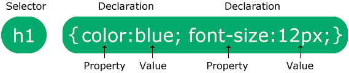

Hình ảnh ở trên chính là cách viết CSS và chúng ta đã tìm hiểu sơ qua tại [Week 3](../week-3/README.html)

👉 Tham khảo: [CSS Selectors](https://www.w3schools.com/cssref/css_selectors.php)

### 1. Selector cơ bản:

- **Element Selector**: chọn tất cả các phần tử có tên là `element`

  ```css
  p {
    color: red;
  }
  ```

  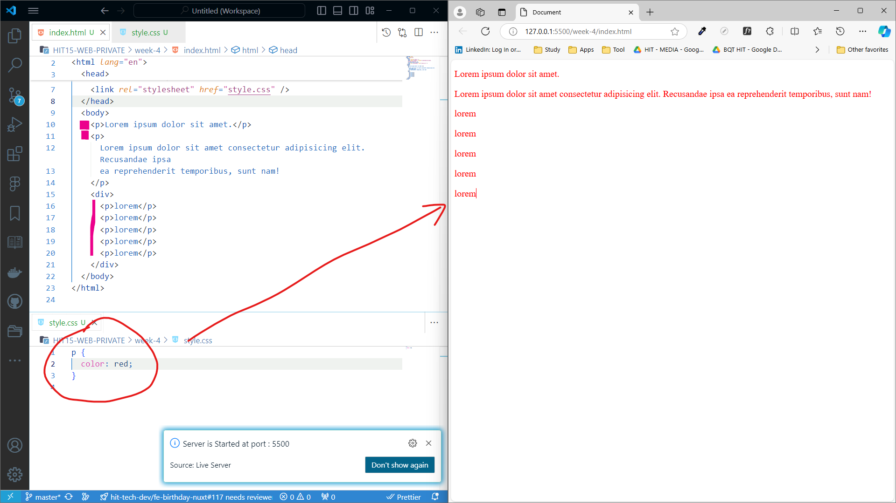

- **ID Selector**: chọn phần tử có `id` là `heading`

  ```css
  #heading {
    font-size: 36px;
    color: blue;
  }
  ```

  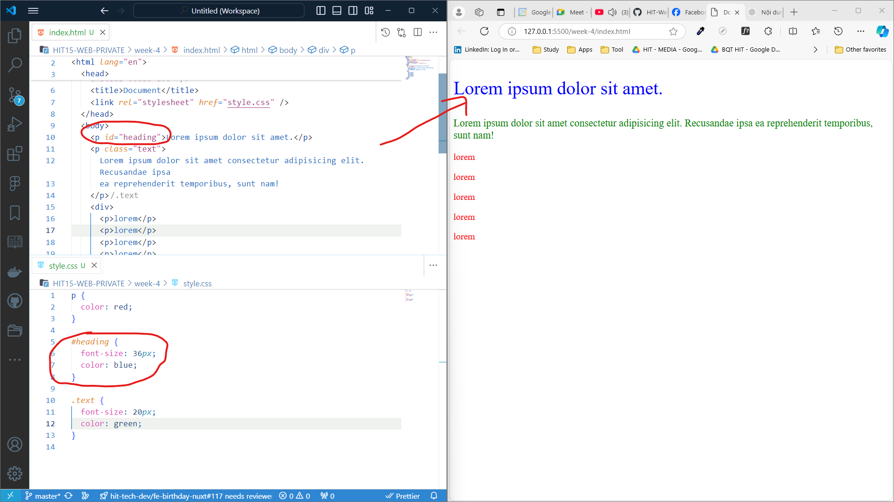

- **Class Selector**: chọn tất cả các phần tử có `class` là `text`

  ```css
  .text {
    text-decoration: line-through;
    color: pink;
  }
  ```

  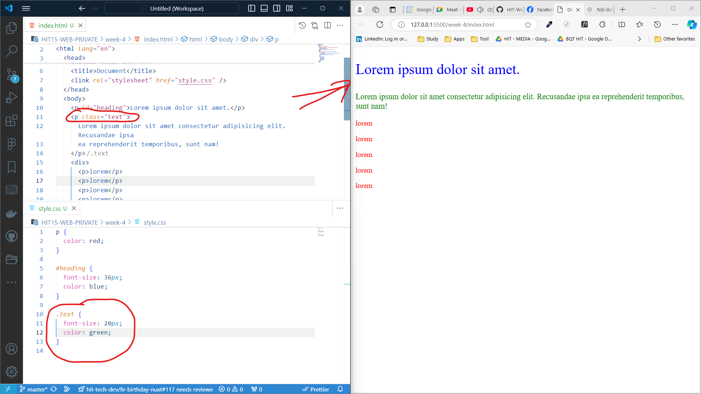

- **Universal Selector**: chọn tất cả các phần tử

  ```css
  * {
    margin: 0;
    padding: 0;
    font-style: italic;
  }
  ```

  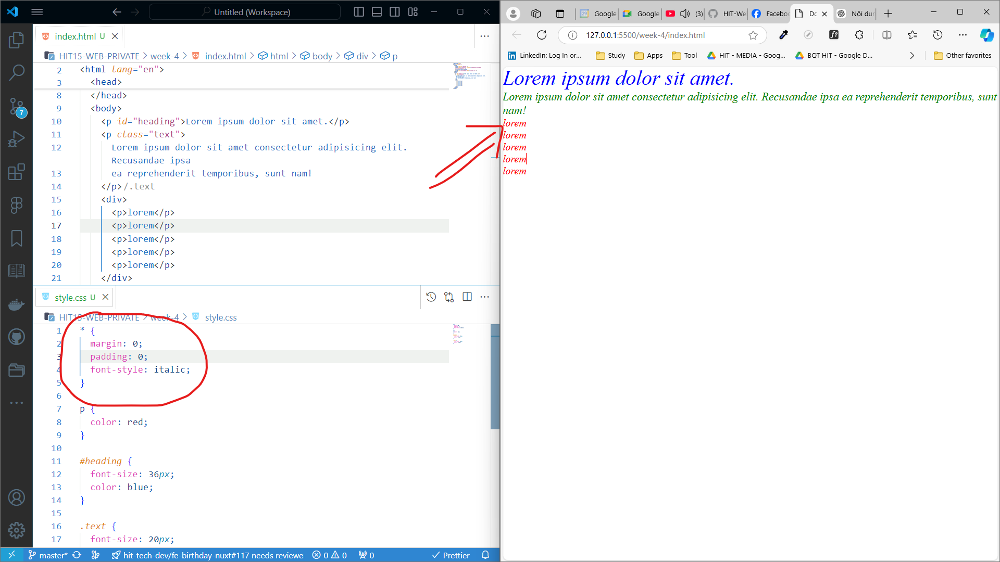

### 2. Selector kết hợp

```html
<div class="wrapper">
  <div class="heading">
    <h1 class="title">Title</h1>
    <h2 class="sub-title">Sub title</h2>
  </div>
  <div class="content">
    <p class="para first-para">First paragraph</p>
    <p class="para second-para">Second paragraph</p>
    <p class="third-para">Third paragraph</p>
  </div>
</div>
<p>
  Lorem ipsum dolor sit amet consectetur adipisicing elit. Voluptatum, nulla!
</p>
```

#### 2.1. **Grouping Selector**: chọn tất cả các phần tử có tên là `element1` hoặc `element2` hoặc `element3`

Chúng ta sử dụng **Grouping Selector** khi bạn muốn các phần tử có cùng thuộc tính nào đó

Bình thường chúng ta sẽ style như thế này:

```css
h1 {
  color: red;
}
h2 {
  color: red;
}
p {
  color: red;
}
```

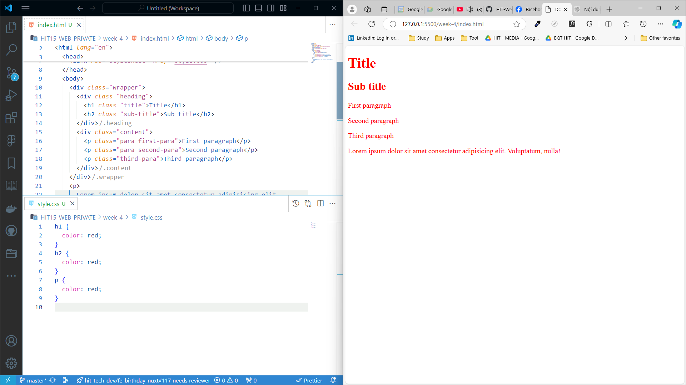

Tuy nhiên cách này khá là dài, chúng ta có 1 cách khác

```css
h1,
h2,
p {
  color: red;
}
```

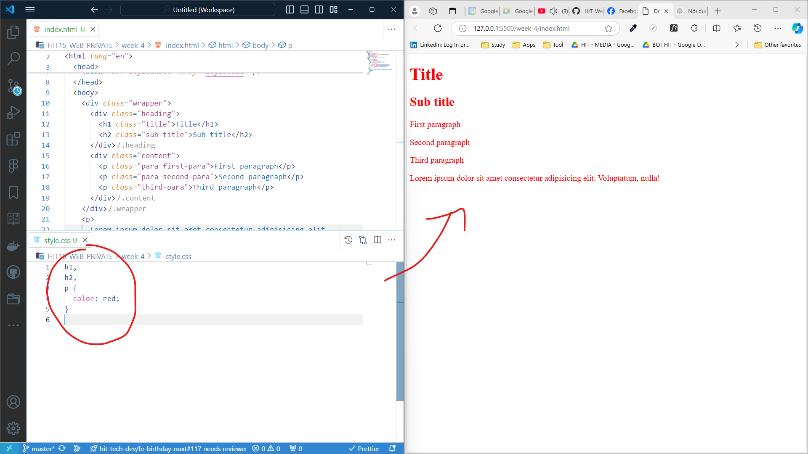

#### 2.2. Descendant Selector: chọn tất cả các phần tử con của phần tử có tên là element

Có 1 trường hợp trong đoạn `html` trên xảy ra như thế này. Chúng ta muốn nội dung trong thẻ `p` trong thẻ `div` có `class="content"` có màu `blue`. Chúng ta sẽ áp dụng **`Element Selector`** như thế này:

```css
p {
  color: blue;
}
```

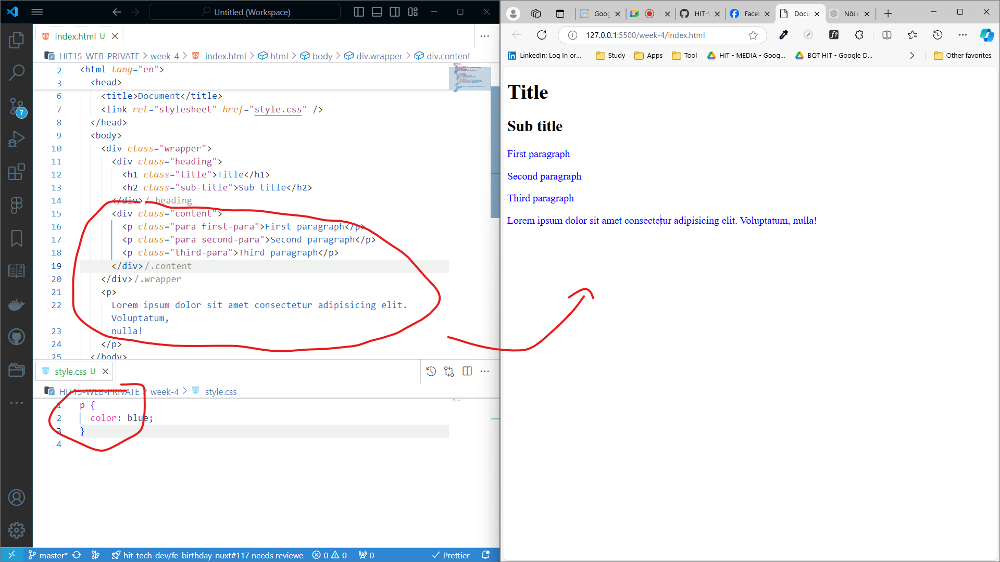

Lúc này xảy ra tình huống ngoài mong muốn đó là thẻ `p` ngoài thẻ thẻ `div` có `class="content"` cũng nhận màu `blue`.

Để xử lý vấn đề này chúng ta sẽ sử dụng **`Descendant Selector`** kết hợp cùng **`Class Selector`** như thế này:

```css
.content p {
  color: blue;
}
```

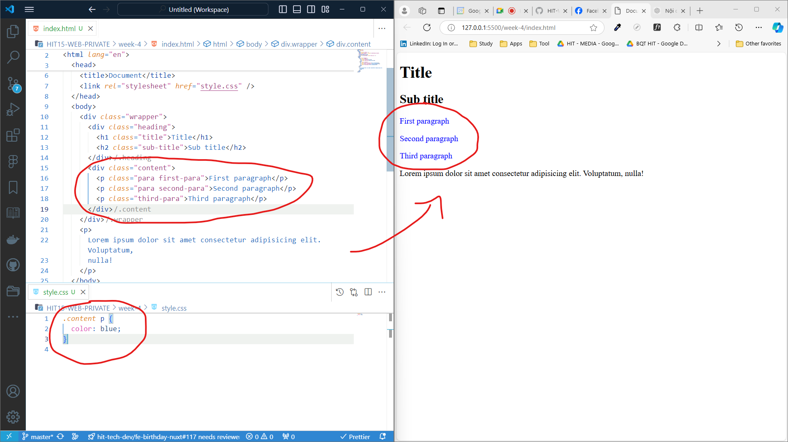

Như bức ảnh ở trên, chúng ta đã có thể áp dụng màu chữ `blue` cho thẻ `p` trong thẻ `div` có `class="content"`

#### 2.3. Child Selector: chọn tất cả các phần tử con trực tiếp của phần tử có tên là element

Trong trường hợp này chúng ta muốn màu chữ của thẻ `p` cuối cùng như này có màu xanh thì sao?
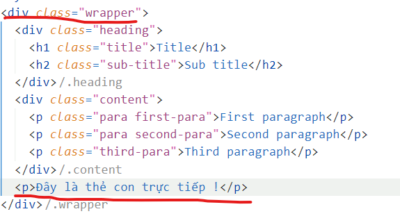
Với cách đầu tiên chúng ta có thẻ đặt `class` cho thẻ `p` đó và style cho nó bằng cách sử dụng **`Descendant Selector`** kết hợp với **`Class Selector`** như ví dụ trên
Còn một cách nữa đó là sử dụng **`Child Selector`** như sau:
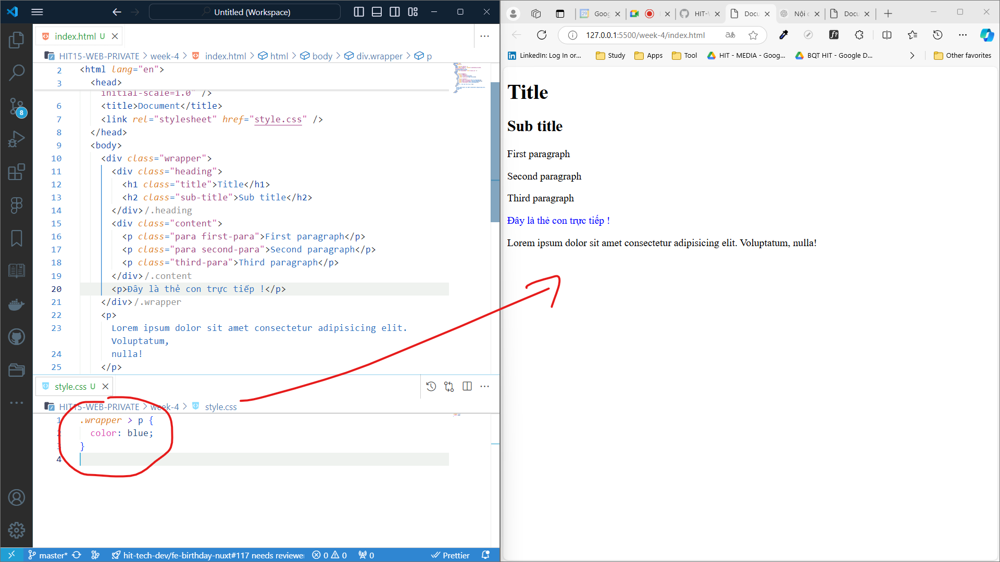

Tại sao lại có kết quả như trên vì các thẻ `p` trong thẻ `div` có `class="content"` không phải là phần tử con trực tiếp của thẻ `div` có `class="wrapper"`

#### 2.4. Sibling Selector

- **Adjacent Sibling Selector**: chọn phần tử cùng cấp đầu tiên sau phần tử có tên là `element`
  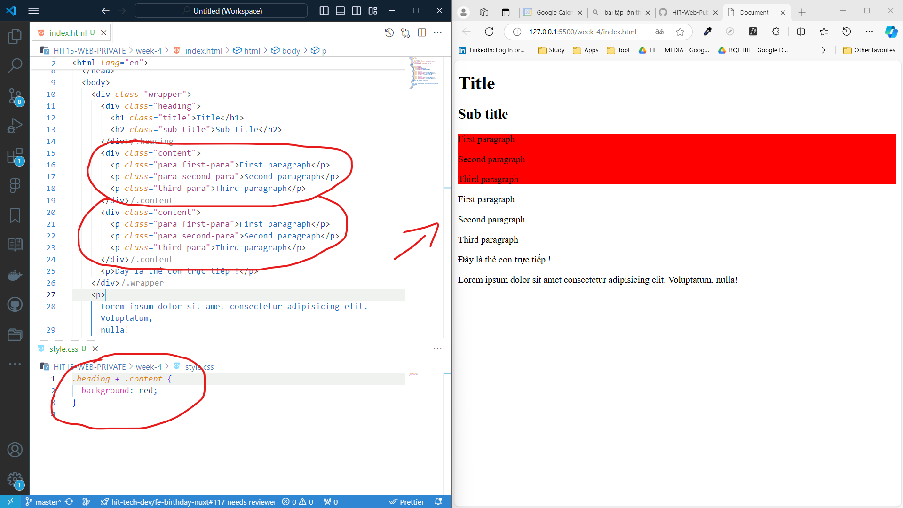
  Như hình ảnh ở trên có 2 thẻ `div` có `class="content"`. Tuy nhiên tôi chỉ muốn thẻ `div` đầu tiên cùng cấp ngay sau thẻ `div` có `class="heading"` có nền màu đỏ, tôi sẽ áp dụng style như sau:

  ```css
  .heading + .content {
    background: red;
  }
  ```

  Lúc này thẻ `div` có `class="content"` cùng cấp ngay sau thẻ `div` có `class="heading"` sẽ nhận màu nền là màu đỏ

- **General Sibling Selector**: chọn tất cả các phần tử cùng cấp sau phần tử có tên là `element`
  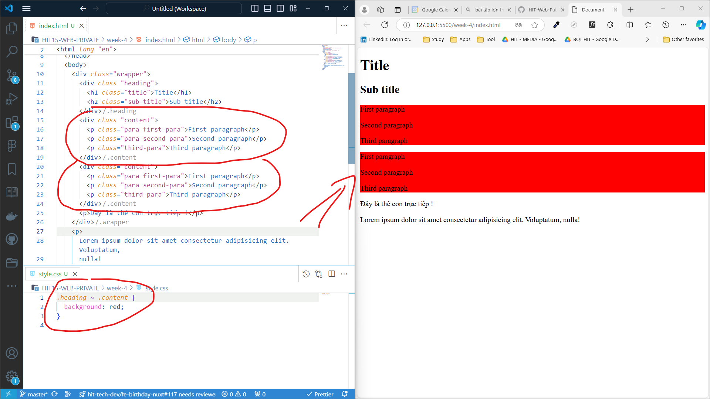
  Khác với trường hợp ở trên, ta muốn tất cả các thẻ `div` có `class="content"` ngay sau thẻ `div` có `class="heading"` có nền màu đỏ, ta chỉ việc thay đổi từ dấu `+` qua dấu `~`
  ```css
  .heading ~ .content {
    background: red;
  }
  ```

#### 2.5. Pseudo-class Selector: chọn phần tử trong trạng thái cụ thể

```html
<ul class="wrap">
  <li class="item">Item 1</li>
  <li class="item">Item 2</li>
  <li class="item">Item 3</li>
  <li class="item">Item 4</li>
  <li class="item">Item 5</li>
</ul>
```

Giả sử chúng ta có 1 đoạn html ở trên. Chúng ta muốn css cho đúng một thẻ `li` trong thẻ `ul`. Lúc này chúng ta không thể nào áp dụng được **`Element Selector`** hay **`Class Slector`**. Để có thể làm được điều đó, chúng ta hãy cùng nhau đi qua các nội dung sau đây

- Sử dụng **`:first-child`** để chọn phần tử đầu tiên

  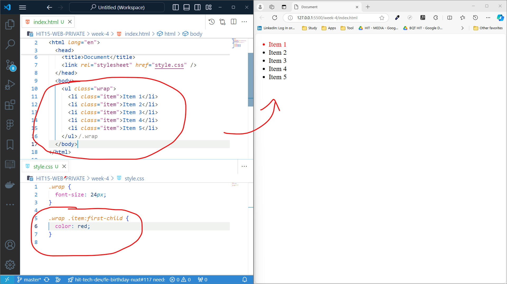

  ```css
  .wrap .item:first-child {
    color: red;
  }
  ```

  Hình ảnh ở trên chính là cách áp dụng style cho thẻ `li` có `class="item"` là phần tử con đầu tiên của thẻ `ul`

- Sử dụng **`:last-child`** để chọn phần tử đầu tiên
  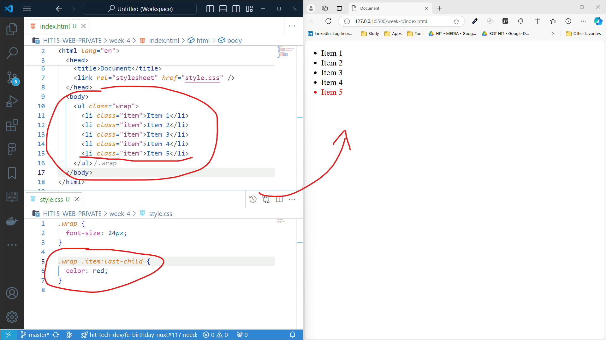

  ```css
  .wrap .item:last-child {
    color: red;
  }
  ```

  Trái ngược với **`:first-child`** ở trên sẽ lựa chọn phần tử đầu tiên thì **`:last-child`** sẽ lựa chọn phần tử con cuối cùng trong thẻ `ul`

- Sử dụng **`:nth-child(n)`** để chọn phần tử thứ `n`

  Ngoài chọn phần tử đầu tiên và cuối cùng, chúng ta còn cách để chọn cụ thể một phần tử thứ `n`

  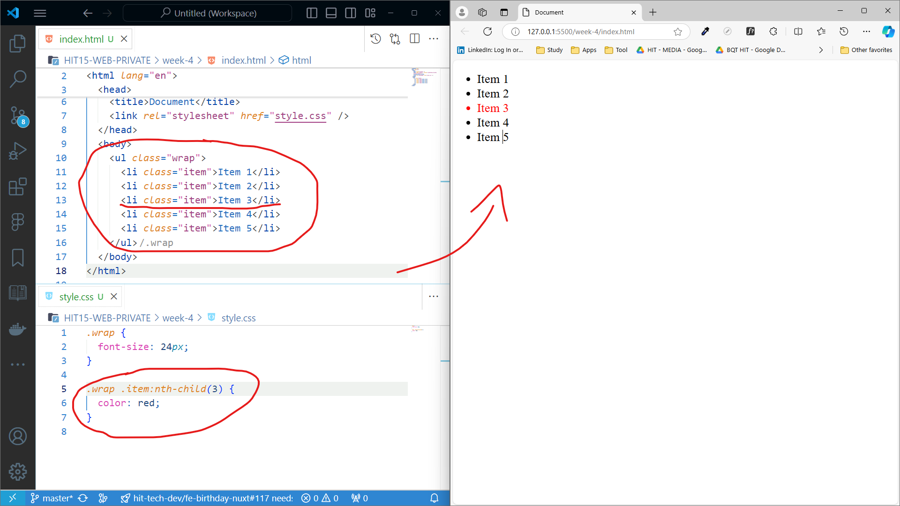

  ```css
  .wrap .item:nth-child(3) {
    color: red;
  }
  ```

  Ở hình ảnh trên là cách chúng ta áp dụng để chọn được phần tử `li` thứ 3 có `class="item"`

- Sử dụng **`:not(selector)`** để chọn tất cả các phần tử không phải là `selector`

  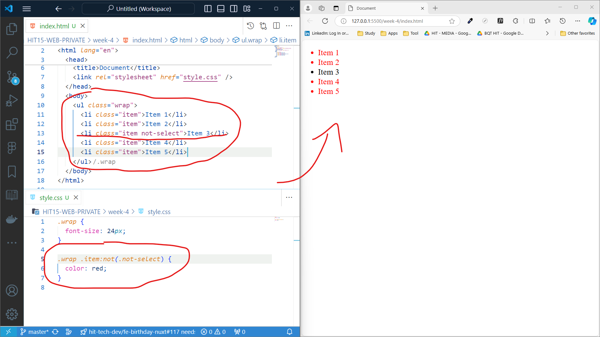

  ```css
  .wrap .item:not(.not-select) {
    color: red;
  }
  ```

  Hình ảnh ở trên chính là cách chúng ta muốn các thẻ khác sẽ nhận màu đỏ, còn thẻ `li` có `class="item no-sleact" sẽ không nhận màu đỏ

Bên cạnh các **`Pseudo-class Selector`** trên, chúng ta có thêm một số cách style khi chúng ta di chuyển chuột vào 1 phần tử.

```html
<!DOCTYPE html>
<html lang="en">
  <head>
    <meta charset="UTF-8" />
    <meta name="viewport" content="width=device-width, initial-scale=1.0" />
    <title>Document</title>
    <link rel="stylesheet" href="style.css" />
  </head>
  <body>
    <button>Click me</button>
  </body>
</html>
```

```css
button {
  font-size: 32px;
  padding: 8px 16px;
}

button:hover {
  background: blue;
  color: white;
}
```

- Sử dụng **`:hover`** để chọn phần tử sẽ được style khi di chuột vào
- Các bạn hãy tự mình trải nghiệm để biết kết quả như thế nào nhé

👉 Tham khảo thêm [Tại đây](https://www.w3schools.com/css/css_pseudo_classes.asp)

## II. Thứ tự ưu tiên CSS

Thứ tự ưu tiên trong CSS (CSS specificity) là quy tắc quyết định thứ tự áp dụng các thuộc tính CSS khi có nhiều quy tắc cùng ảnh hưởng đến một phần tử.

| **Selector** | **Thứ tự ưu tiên** | **Điểm** |
| :----------: | :----------------: | :------: |
|  !important  |         1          |    ♾️    |
| inline style |         2          |   1000   |
|      id      |         3          |   100    |
|    class     |         4          |    10    |
|   element    |         5          |    1     |

##### - **!important**

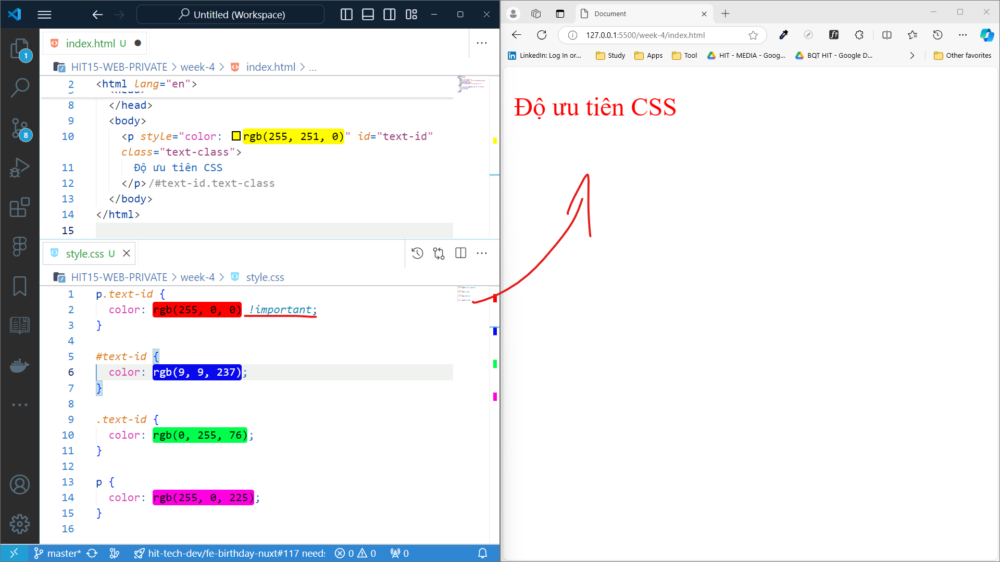

##### - **inline style**

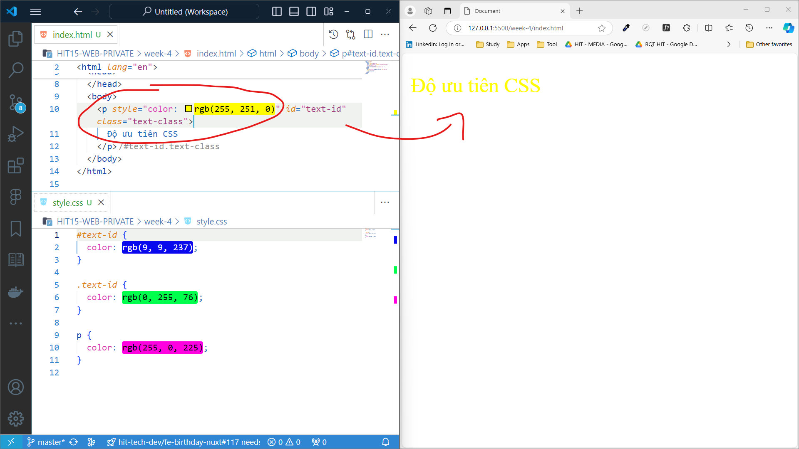

##### - **id**

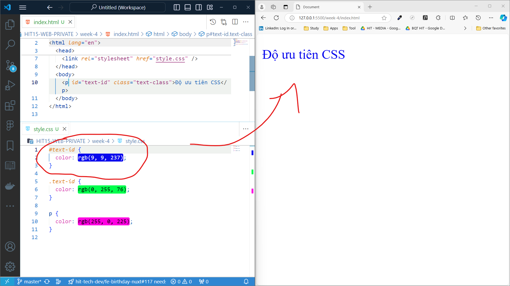

##### - **class**

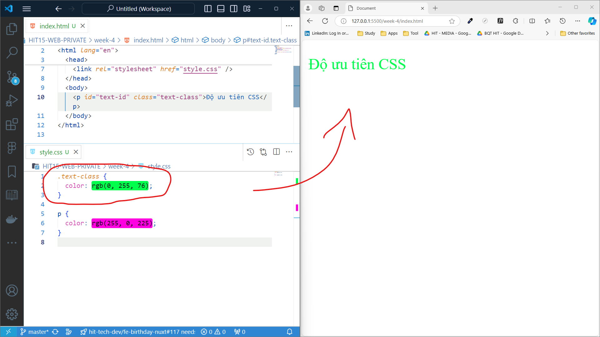

👉 Tham khảo [Tại đây](https://www.w3schools.com/css/css_specificity.asp)

## III. CSS Variables

- **CSS Variables** là các biến được định nghĩa trong CSS để lưu trữ các giá trị có thể tái sử dụng, chẳng hạn như màu sắc, font-size, hoặc bất kỳ thuộc tính nào khác.

- Sử dụng **CSS Variables** giúp bạn dễ dàng thay đổi và quản lý các giá trị này trong toàn bộ tài liệu CSS mà không cần phải chỉnh sửa từng nơi sử dụng chúng.

- Cách sử dụng:

  - CSS Variables được khai báo bằng cách sử dụng dấu gạch ngang kép `(--)` trước tên biến
  - Thường được khai báo bên trong một `:root` selector

    ```css
    :root {
      --primary-color: #3498db;
      --secondary-color: #2ecc71;
      --font-size-large: 20px;
    }
    ```

  - Để sử dụng biến, ta sử dụng cú pháp `var(--tên-biến)`, trong đó `--tên-biến` là tên của biến đã khai báo.

    ```css
    h1 {
      color: var(--primary-color);
      font-size: var(--font-size-large);
    }

    button {
      background-color: var(--secondary-color);
      color: white;
      padding: 10px;
      border: none;
      border-radius: 5px;
    }
    ```

## IV. Quy tắc đặt tên BEM

#### 1. Khái niệm

- **BEM** là một quy ước đặt tên class giúp chúng ta quản lý CSS dễ dàng hơn
- **BEM** bao gồm 3 phần chính: `Block`, `Element`, `Modifier`
  - `Block`: tên của thành phần
  - `Element`: tên của phần tử bên trong block
  - `Modifier`: trạng thái của block hoặc element

#### 2. Tại sao sử dụng BEM?

- Dễ dàng quản lý CSS
- Tăng khả năng tái sử dụng CSS
- Trong một dự án, có thể có nhiều người cùng làm việc, việc đặt tên class đồng nhất sẽ giúp dễ dàng hơn trong việc hiểu code của người khác

#### 3. Cú pháp đặt tên class

- `.block`
- `.block__element`
- `.block--modifier`
- `.block__element--modifier`

```html
<div class="card">
  
  <div class="card__content">
    <h2 class="card__title">Title</h2>
    <p class="card__description">Description</p>
    <button class="card__button card__button--red">Click me</button>
    <button class="card__button card__button--disable">Disable button</button>
  </div>
</div>
```

```css
.card {
  width: max-content;
  background-color: #f1f1f1;
}
.card__image {
  width: 100%;
  max-width: 200px;
}
.card__content {
  padding: 10px;
}
.card__title {
  font-size: 20px;
}
.card__description {
  font-size: 16px;
}
.card__button {
  padding: 5px 10px;
}
.card__button--red {
  background-color: red;
  color: white;
}
.card__button--disable {
  background-color: gray;
  color: white;
  cursor: not-allowed;
}
```

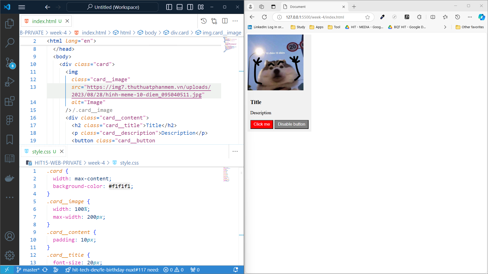

## V. Nhúng Icon, nhúng font
1. Nhúng icon
- Truy cập trang web https://cdnjs.com/libraries/font-awesome

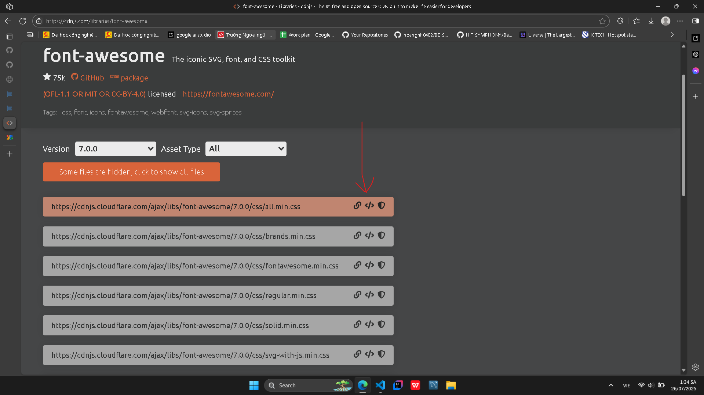

- Truy cập trang web https://fontawesome.com/search?ic=free&o=r để tra icon

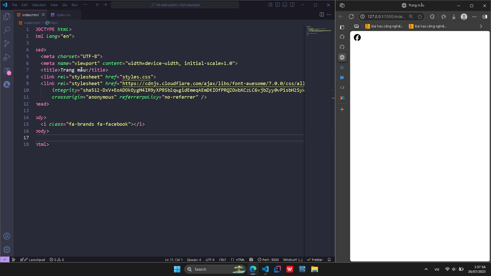
2. Nhúng font

- Truy cập https://fonts.google.com/

- Nội dung này hãy liên hệ tới các anh, chị Support để được hướng dẫn nhoa~


## VI. Tò mò tò vò!

1. Tại sao lại cần tới **CSS Selector**?

2. Một thẻ có thể đặt nhiều `class` không? Nếu có thì đặt tên `class` như thế nào?

3. Có thể kết hợp các `Selecter` với nhau không?

4. Giả sử trong 1 thẻ `div` có `class="wrap"` có 1 thẻ `p` có `class="item"` nhưng bên ngoài cũng có 1 thẻ khác có `class="item"` thì phải làm sao để chỉ có thẻ `p` nhận được các thuộc tính css?

5. Tôi có 1 đoạn html như sau:

```html
<p class="text">Đừng đọc dòng này!</p>
```

Tôi có thể viết css như thế này không? Nếu có thể viết như này thì nó có lợi ích gì?

```css
p.text {
  color: red;
}
```

6. Game giúp bạn master CSS Selector 👉 [tại đây](https://flukeout.github.io/)
