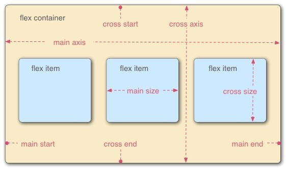
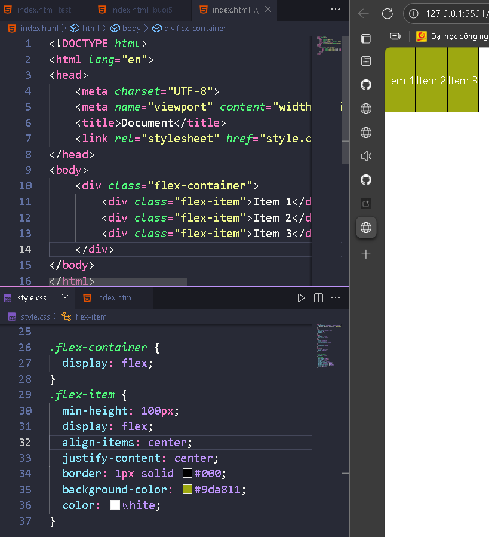
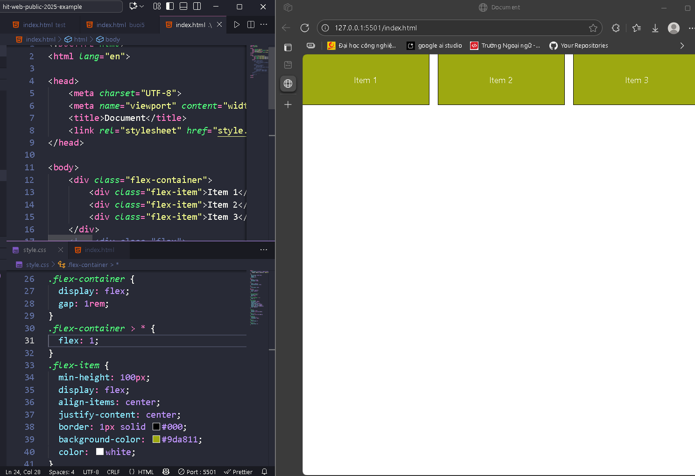
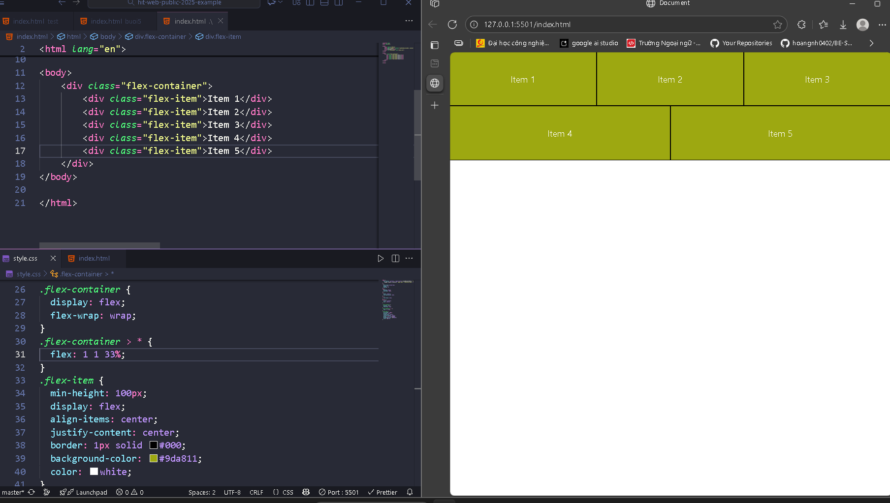
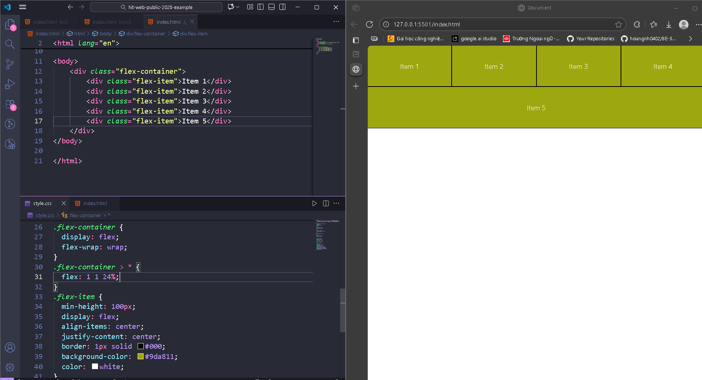
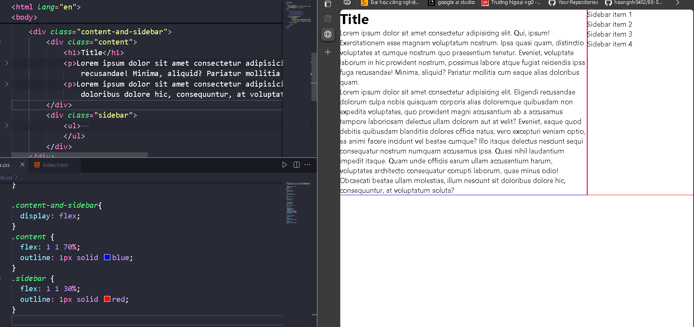
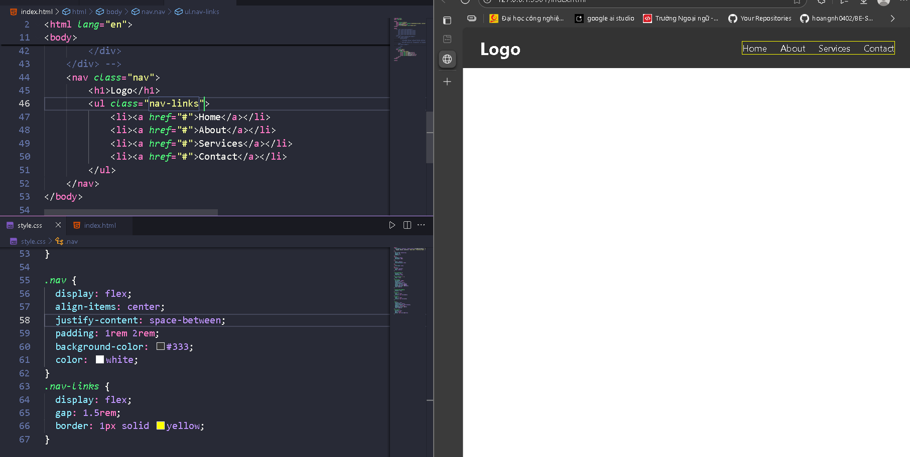
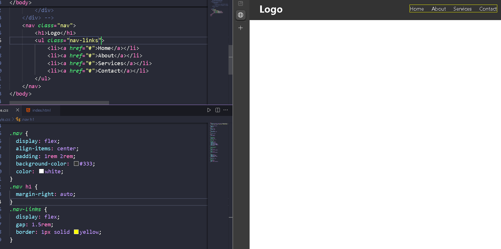
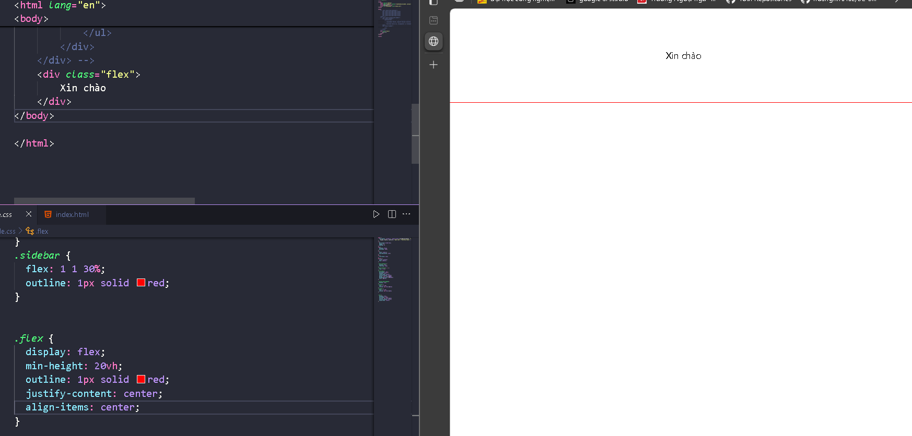

# HIT16-WEB-PRIVATE-2025 - WEEK 5

---

## [Home](../index.html)

---

## Nội dung

### [I. Các khái niệm cơ bản trong Flexbox](#i-các-khái-niệm-cơ-bản-trong-flexbox)

### [II. Thuộc tính Flexbox](#ii-thuộc-tính-flexbox)

### [III. Một số layout sử dụng flexbox](#iii-một-số-layout-sử-dụng-flexbox)

---

## Flexbox trong CSS

Flexbox là một công cụ mạnh mẽ trong CSS giúp căn chỉnh, sắp xếp, và phân bổ không gian giữa các phần tử trong một container. Nó đặc biệt hữu ích cho việc tạo bố cục web responsive nhờ sự linh hoạt của nó

---

## I. Các khái niệm cơ bản trong Flexbox



1. **Flex Container**:

   - Là phần tử cha có `display: flex;`. Khi một phần tử trở thành flex container, tất cả các phần tử con trực tiếp của nó sẽ được gọi là **flex items** và được sắp xếp theo các quy tắc của Flexbox.

2. **Flex Item**:

   - Là các phần tử con trực tiếp bên trong một flex container. Các flex items có thể được điều chỉnh và sắp xếp linh hoạt theo trục chính và trục phụ của container.

3. **Main Axis (Trục chính)**:

   - Trục chính là trục mà flex items được sắp xếp theo. Trục chính mặc định là chiều ngang, nhưng có thể thay đổi bằng thuộc tính `flex-direction`.

4. **Cross Axis (Trục phụ)**:

   - Trục vuông góc với trục chính. Trục phụ giúp căn chỉnh các flex items dọc theo chiều vuông góc với trục chính.

5. **Main Size**:

   - Kích thước của một flex item theo chiều của trục chính.

6. **Cross Size**:
   - Kích thước của một flex item theo chiều của trục phụ.

---

### II. Thuộc tính Flexbox

1. **`display: flex;`**

   - Kích hoạt Flexbox cho phần tử, biến nó thành flex container. Các phần tử con của nó sẽ tự động trở thành flex items và chịu tác động của các thuộc tính Flexbox.

   ```css
   .container {
     display: flex;
   }
   ```

2. **`flex-direction`**

   - Xác định hướng sắp xếp của các flex items.
   - Giá trị:
     - `row` (mặc định): Sắp xếp từ trái sang phải.
     - `row-reverse`: Sắp xếp từ phải sang trái.
     - `column`: Sắp xếp từ trên xuống dưới.
     - `column-reverse`: Sắp xếp từ dưới lên trên.
   - **Ví dụ**:
     ```css
     .container {
       display: flex;
       flex-direction: row;
     }
     ```

3. **`justify-content`**

   - Căn chỉnh các flex items dọc theo trục chính.
   - Giá trị:
     - `flex-start`: Căn về đầu trục chính.
     - `flex-end`: Căn về cuối trục chính.
     - `center`: Căn giữa trên trục chính.
     - `space-between`: Khoảng cách đều giữa các items.
     - `space-around`: Khoảng cách đều xung quanh các items (bao gồm cả hai đầu container).
     - `space-evenly`: Khoảng cách bằng nhau giữa các items và các cạnh của container.
   - **Ví dụ**:
     ```css
     .container {
       display: flex;
       justify-content: space-between;
     }
     ```

4. **`align-items`**

   - Căn chỉnh các flex items dọc theo trục phụ.
   - Giá trị:
     - `flex-start`: Căn về đầu trục phụ.
     - `flex-end`: Căn về cuối trục phụ.
     - `center`: Căn giữa trên trục phụ.
     - `baseline`: Căn các items theo baseline của văn bản.
     - `stretch` (mặc định): Các items sẽ giãn đầy container dọc theo trục phụ.
   - **Ví dụ**:
     ```css
     .container {
       display: flex;
       align-items: center;
     }
     ```

5. **`align-content`**

   - Căn chỉnh các dòng của flex items khi có nhiều dòng (chỉ áp dụng khi `flex-wrap: wrap;`).
   - Giá trị:
     - `flex-start`, `flex-end`, `center`, `space-between`, `space-around`, `stretch`.
   - **Ví dụ**:
     ```css
     .container {
       display: flex;
       flex-wrap: wrap;
       align-content: space-around;
     }
     ```

6. **`flex-wrap`**

   - Cho phép các flex items xuống dòng khi container không đủ rộng.
   - Giá trị:
     - `nowrap` (mặc định): Các items nằm trên một dòng duy nhất.
     - `wrap`: Các items sẽ xuống dòng khi không đủ không gian.
     - `wrap-reverse`: Các items xuống dòng nhưng theo thứ tự ngược.
   - **Ví dụ**:
     ```css
     .container {
       display: flex;
       flex-wrap: wrap;
     }
     ```

7. **`gap`**

   - Tạo khoảng cách giữa các flex items.
     - row-gap: khoảng cách giữa mỗi hàng
     - column-gap: khoảng cách giữa mỗi cột
   - **Ví dụ**:
     ```css
     .container {
       display: flex;
       gap: 10px 20px;
       <!--  Khoảng cách giữa hàng là 10px;
        Khoảng cách giữa cột là 20px; -->
     }
     ```

8. **`flex-grow`**

   - Điều chỉnh khả năng mở rộng của flex item khi có không gian trống.
   - Giá trị: Số không âm (mặc định là `0`). Số càng lớn, flex item sẽ càng mở rộng nhiều hơn.
   - **Ví dụ**:
     ```css
     .item {
       flex-grow: 1;
     }
     ```

9. **`flex-shrink`**

   - Điều chỉnh khả năng co lại của flex item khi không đủ không gian.
   - Giá trị: Số không âm (mặc định là `1`). Số càng lớn, flex item sẽ co lại nhiều hơn.
   - **Ví dụ**:
     ```css
     .item {
       flex-shrink: 1;
     }
     ```

10. **`flex-basis`**

    - Thiết lập kích thước ban đầu của flex item trước khi áp dụng `flex-grow` và `flex-shrink`.
    - Giá trị có thể là bất kỳ kích thước hợp lệ nào (px, %, em, v.v.).
    - **Ví dụ**:
      ```css
      .item {
        flex-basis: 200px;
      }
      ```

11. **`align-self`**

    - Căn chỉnh một flex item theo trục phụ, ghi đè thuộc tính `align-items` của container.
    - Giá trị: `auto`, `flex-start`, `flex-end`, `center`, `baseline`, `stretch`.
    - **Ví dụ**:
      ```css
      .item {
        align-self: center;
      }
      ```

12. **`order`**
    - Xác định thứ tự sắp xếp của flex item trong container, mặc định là `0`.
    - Giá trị: Số nguyên (có thể âm).
    - **Ví dụ**:
      ```css
      .item {
        order: -1;
      }
      ```

## III. Một số layout sử dụng flexbox
- Khi muốn các phần tử html trên cùng một dòng

- Khi muốn các phần tử html có cùng kích cỡ và chiếm 100% width của phần tử cha (rất hay dùng)

- Layout này khá giống grid (có thể thay đổi flex-basis tùy trường hợp)


- Layout có content và sidebar

- Navigation bar ở đầu trang
  - Cách 1
  - Cách 2(nên dùng hơn)
  
- Muốn center bất cứ một thứ gì trong container (chữ hay div,...)



---

### Ví dụ tổng hợp và trò chơi

👉 [Ví dụ ở đây](https://codepen.io/ndangelo/pen/BaamRam)
👉 [Trò chơi ở đây](https://flexboxfroggy.com/)
