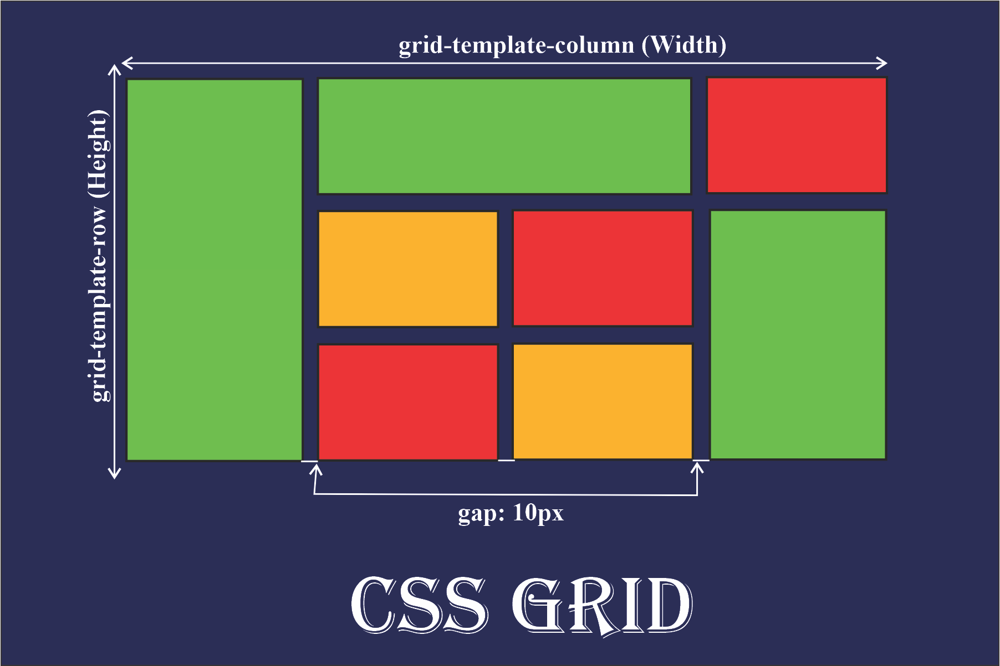
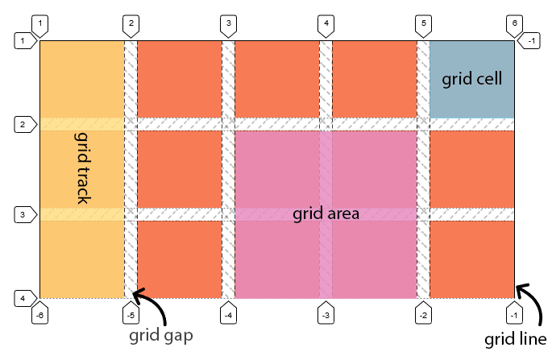
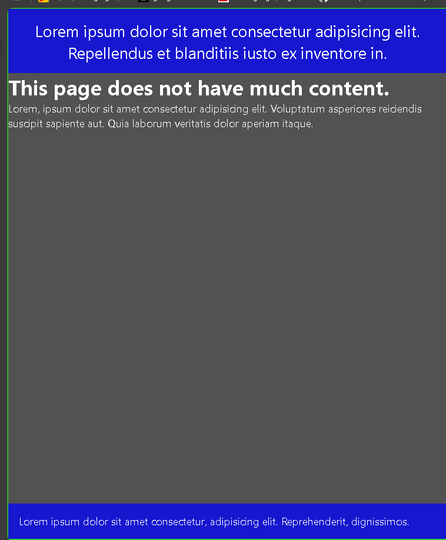
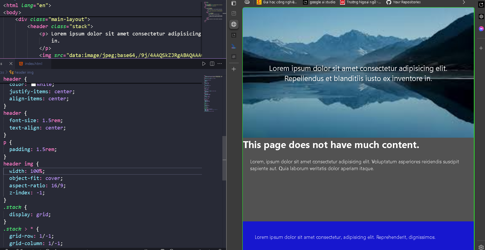
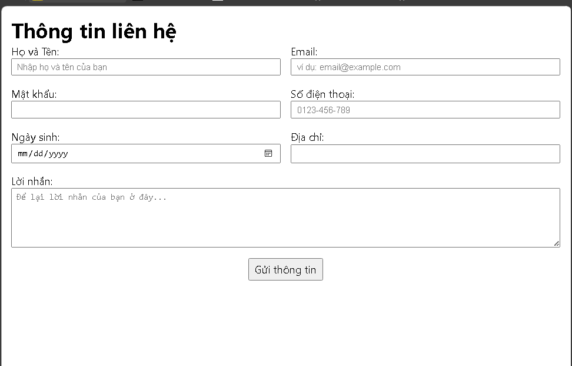
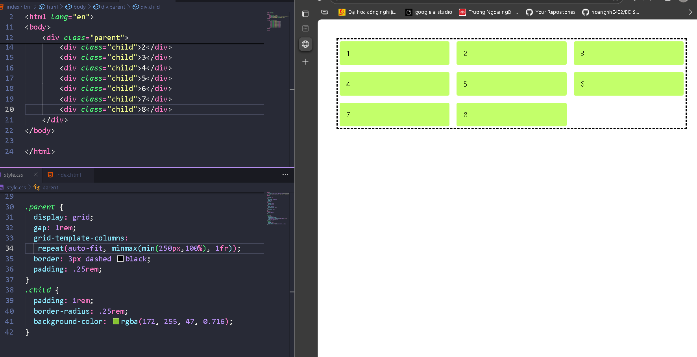
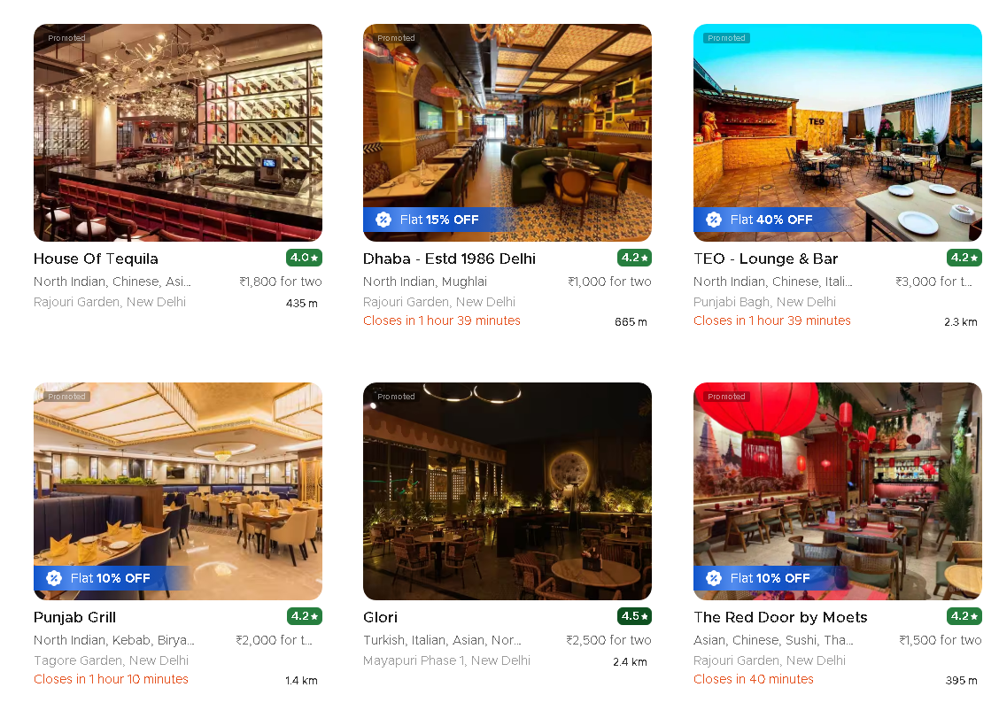
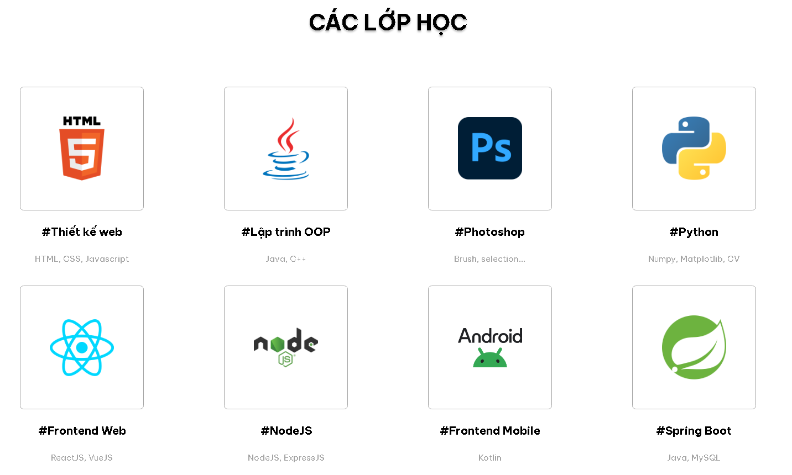

# HIT16-WEB-PRIVATE-2025 - WEEK 7

---

## [Home](../index.html)

---

## Nội dung

## [I. Tổng quan CSS Grid](#i-tổng-quan-về-css-grid)

## [II. Cách sử dụng CSS Grid](#ii-cách-sử-dụng-css-grid)

## [III. CSS Responsive](#iii-css-responsive-tạo-giao-diện-linh-hoạt-và-thích-nghi)

---



### **CSS Grid: Hệ thống bố cục mạnh mẽ và chi tiết**

CSS Grid là một hệ thống layout được thiết kế để giúp bạn xây dựng bố cục web một cách chính xác, dễ dàng và nhanh chóng. Grid cho phép bạn định nghĩa không gian theo cả **hàng (row)** và **cột (column)**, giúp kiểm soát toàn diện layout của trang web.

---

### **I. Tổng quan về CSS Grid**



CSS Grid bao gồm các khái niệm cơ bản sau:

1. **Grid Container**:

   - Là phần tử cha được thiết lập thuộc tính `display: grid`
   - Chịu trách nhiệm định nghĩa bố cục, số hàng, số cột, và vị trí của các phần tử con.

2. **Grid Item**:

   - Là các phần tử con trực tiếp bên trong Grid Container.
   - Chúng có thể được đặt vào bất kỳ vị trí nào trong grid và tùy chỉnh kích thước, khoảng cách một cách linh hoạt.

3. **Grid Row và Grid Column**:

   - **Grid Row**: Hàng ngang trong grid, được tạo ra bởi `grid-template-rows`.
   - **Grid Column**: Cột dọc trong grid, được tạo ra bởi `grid-template-columns`.

4. **Grid Line**:

   - Là các đường dọc hoặc ngang, chia Grid Container thành các phần nhỏ.
   - Các Grid Line được đánh số bắt đầu từ 1 và kéo dài qua toàn bộ Grid Container.

5. **Grid Track**:

   - Là khoảng không gian giữa hai Grid Line, bao gồm các hàng hoặc cột.

6. **Grid Cell**:

   - Là một ô duy nhất, nơi một Grid Item có thể được đặt.

7. **Grid Area**:

   - Là vùng bao gồm một hoặc nhiều Grid Cell, có thể đặt tên hoặc xác định bằng các dòng.

8. **Grid Gap**:
   - Là khoảng cách giữa các hàng và cột, được thiết lập thông qua `grid-gap`.

---

### **II. Cách sử dụng CSS Grid**

##### **1. Khai báo một Grid Container**

Để biến một phần tử thành Grid Container, sử dụng thuộc tính `display: grid`:

```css
.container {
  display: grid;
}
```

##### **2. Định nghĩa số hàng và cột**

- **`grid-template-columns`**: Định nghĩa số lượng và kích thước của các cột.
- **`grid-template-rows`**: Định nghĩa số lượng và kích thước của các hàng.

Ví dụ:

```css
.container {
  display: grid;
  grid-template-columns: 100px 200px 100px; /* Ba cột với kích thước khác nhau */
  grid-template-rows: 150px 150px; /* Hai hàng, mỗi hàng cao 150px */
}
```

- **Sử dụng đơn vị `fr`**:  
  Đơn vị `fr` chia sẻ không gian còn lại trong grid container.

```css
.container {
  display: grid;
  grid-template-columns: 1fr 2fr 1fr; /* Tỷ lệ các cột: 1-2-1 */
}
```

- **Sử dụng hàm `repeat()`**:  
  Rút gọn cú pháp khi có các cột hoặc hàng lặp lại.

```css
.container {
  display: grid;
  grid-template-columns: repeat(3, 1fr); /* Ba cột, mỗi cột có kích thước 1fr */
}
```

##### **3. Khoảng cách giữa các hàng và cột**

- **`grid-gap`**: Khoảng cách giữa các hàng và cột.

```css
.container {
  display: grid;
  grid-gap: 20px; /* Khoảng cách 20px giữa các hàng và cột */
}
```

- **`grid-row-gap`** và **`grid-column-gap`**: Định nghĩa khoảng cách riêng biệt cho hàng và cột.

```css
.container {
  display: grid;
  grid-row-gap: 10px; /* Khoảng cách giữa các hàng */
  grid-column-gap: 15px; /* Khoảng cách giữa các cột */
}
```

##### **4. Định vị trí Grid Item**

- **`grid-column`**: Xác định vị trí bắt đầu và kết thúc của Grid Item theo cột.

```css
.item {
  grid-column: 1 / 3; /* Bắt đầu từ cột 1 và kết thúc trước cột 3 */
}
```

- **`grid-row`**: Xác định vị trí bắt đầu và kết thúc của Grid Item theo hàng.

```css
.item {
  grid-row: 2 / 4; /* Bắt đầu từ hàng 2 và kết thúc trước hàng 4 */
}
```

- **`grid-area`**: Định nghĩa vùng bao phủ của Grid Item.

```css
.item {
  grid-area: 1 / 1 / 3 / 4; /* Từ hàng 1, cột 1 đến trước hàng 3, cột 4 */
}
```

- **`span`**: Kéo dài Grid Item qua nhiều hàng hoặc cột.

```css
.item {
  grid-column: span 2; /* Kéo dài qua 2 cột */
  grid-row: span 3; /* Kéo dài qua 3 hàng */
}
```

##### **5. Đặt tên và định nghĩa Grid Area**

Sử dụng `grid-template-areas` để đặt tên cho các vùng trong Grid:

```css
.container {
  display: grid;
  grid-template-areas:
    "header header header"
    "main main sidebar"
    "footer footer footer";
}

.header {
  grid-area: header;
}
.main {
  grid-area: main;
}
.sidebar {
  grid-area: sidebar;
}
.footer {
  grid-area: footer;
}
```

!!! ::: Ngoài ra, còn có sử dụng `align-items`, `justify-items`, `align-content`, `justify-content`, `align-self`, `justify-self` để căn chỉnh vị trí của các ô trong grid.
!!! ::: Thuộc tính items căn chỉnh các item trong cell (ô grid). Còn thuộc tính content coi toàn bộ item là 1 khối và căn chỉnh nó.

##### 6. Một số layout với grid

- Khi muốn footer ở phía cuối trang nhưng main chưa có nhiều nội dung
  

```html
<div class="main-layout">
  <header>
    <p>
      Lorem ipsum dolor sit amet consectetur adipisicing elit. Repellendus et
      blanditiis iusto ex inventore in.
    </p>
  </header>
  <main>
    <div class="container">
      <h1 class="title">This page does not have much content.</h1>
      <p>
        Lorem, ipsum dolor sit amet consectetur adipisicing elit. Voluptatum
        asperiores reiciendis suscipit sapiente aut. Quia laborum veritatis
        dolor aperiam itaque.
      </p>
    </div>
  </main>
  <footer>
    <p>
      Lorem ipsum dolor sit amet consectetur, adipisicing elit. Reprehenderit,
      dignissimos.
    </p>
  </footer>
</div>
```

```css
header,
footer {
  background-color: rgba(0, 0, 255, 0.723);
  color: white;
  padding: 1rem;
}
.container {
  color: white;
}
.main-layout {
  border: 3px solid limegreen;
  height: 100vh; /* Fallback for older browsers */
  height: 100dvh;
  display: grid;
  grid-template-rows: auto 1fr auto;
}

header {
  font-size: 1.5rem;
  text-align: center;
}
```

- Khi muốn stack (chồng) nội dung, ví dụ chữ trên ảnh nhưng không muốn dùng positon.

!!! ::: Điểm lợi là có thể dùng justify-content, align-content, justify-items,... để căn chỉnh. Nhưng không nên dùng nếu cần di chuyển nội dung một khoảng px nào đó mà hãy dùng position.



```css
header {
  color: white;
  justify-items: center;
  align-items: center;
}
.stack {
  display: grid;
}
.stack > * {
  grid-row: 1/-1;
  grid-column: 1/-1;
}
```

!!! ::: grid-row: 1/-1; grid-column: 1/-1; khiến cho các item trong grid chiếm toàn bộ các ô => Các item đều chiếm toàn bộ thì sẽ chồng lên nhau.

- Dùng trong các biểu mẫu form

```html
<h1>Thông tin liên hệ</h1>
<form class="form">
  <!-- Input 1: Text -->
  <div class="form-group">
    <label for="fullName">Họ và Tên:</label>
    <input
      type="text"
      id="fullName"
      name="fullName"
      placeholder="Nhập họ và tên của bạn"
      required
    />
  </div>

  <!-- Input 2: Email -->
  <div class="form-group">
    <label for="email">Email:</label>
    <input
      type="email"
      id="email"
      name="email"
      placeholder="ví dụ: email@example.com"
      required
    />
  </div>

  <!-- Input 3: Password -->
  <div class="form-group">
    <label for="password">Mật khẩu:</label>
    <input type="password" id="password" name="password" required />
  </div>

  <!-- Input 4: Telephone -->
  <div class="form-group">
    <label for="phone">Số điện thoại:</label>
    <input type="tel" id="phone" name="phone" placeholder="0123-456-789" />
  </div>

  <!-- Input 5: Date -->
  <div class="form-group">
    <label for="birthdate">Ngày sinh:</label>
    <input type="date" id="birthdate" name="birthdate" />
  </div>

  <div class="form-group">
    <label for="address">Địa chỉ:</label>
    <input type="text" id="address" name="address" />
  </div>

  <!-- Text Area -->
  <div class="form-group form-group--full-width">
    <label for="message">Lời nhắn:</label>
    <textarea
      id="message"
      name="message"
      rows="5"
      placeholder="Để lại lời nhắn của bạn ở đây..."
    ></textarea>
  </div>

  <!-- Submit Button -->
  <button type="submit">Gửi thông tin</button>
</form>
```

```css
.form {
  display: grid;
  grid-template-columns: 1fr 1fr;
  gap: 1rem;
}
.form-group {
  display: grid;
}
.form-group input,
textarea {
  padding: 0.25rem 0.5rem;
}
.form-group--full-width {
  grid-column: 1/-1;
}
.form button {
  grid-column: 1/-1;
  justify-self: center;
  padding: 0.25rem 0.5rem;
}
```



---

### III. **CSS Responsive: Tạo giao diện linh hoạt và thích nghi**


Responsive Web Design (RWD) đảm bảo giao diện hoạt động tốt trên mọi thiết bị bằng cách sử dụng layout và styling linh hoạt.


#### **1. Cách thức hoạt động**

- Sử dụng các đơn vị đo lường linh hoạt như `%`, `em`, `rem`, ... cho các thuộc tính:

  - rem cho font-size, padding, margin, gap,..

- Sử dụng Media Queries để thay đổi layout, font-size, màu sắc, ...

- Sử dụng Flexbox hoặc CSS Grid để xây dựng layout linh hoạt.

#### **2. Media Queries**

Sử dụng Media Queries để thay đổi layout dựa trên kích thước màn hình.

- **Cú pháp**:

```css
@media (36px <= width <= 1096px) {
  /* CSS properties */
}
```

Media queries như một câu lệnh if, "nếu mà kích cỡ màn hình >=36px và <=1096px thì thêm nhưng thuộc tính sau đây vào các class sau".

!!! ::: Chú ý là dấu "<=" phải tách ra khỏi width, như thế này là sai width<=1024px.

- **Ví dụ:**

```css
@media (width <= 768px) {
  .container {
    grid-template-columns: 1fr; /* Một cột duy nhất trên màn hình nhỏ */
  }
}
```

- **Breakpoints:**

  - Extra small devices: 0px - 575px.
  - Small devices: 576px - 767px.
  - Medium devices: 768px - 991px.
  - Large devices: 992px - 1199px.
  - Extra large devices: 1200px trở lên.

- **Ví dụ với Breakpoints thường dùng**:

```css
/* Màn hình nhỏ */
@media (width <= 575px) {
  .container {
    grid-template-columns: 1fr;
  }
}

/* Màn hình trung bình */
@media (576px <= width <= 767px) {
  .container {
    grid-template-columns: repeat(2, 1fr);
  }
}

/* Màn hình lớn */
@media (width >= 768px) {
  .container {
    grid-template-columns: repeat(3, 1fr);
  }
}
```

#### **3. Sử dụng CSS Grid linh hoạt cho Responsive**

CSS Grid kết hợp với Media Queries là công cụ mạnh mẽ để xây dựng giao diện linh hoạt.

Ví dụ:

```html
<div class="container">
  <div class="item">1</div>
  <div class="item">2</div>
  <div class="item">3</div>
</div>
```

```css
.container {
  display: grid;
  grid-template-columns: repeat(3, 1fr);
  gap: 20px;
}

/* Responsive: màn hình nhỏ */
@media (width <= 768px) {
  .container {
    grid-template-columns: repeat(2, 1fr);
  }
}

/* Responsive: màn hình rất nhỏ */
@media (width <= 480px) {
  .container {
    grid-template-columns: 1fr;
  }
}
```

**Kết quả**:

- Màn hình lớn: Hiển thị 3 cột.
- Màn hình trung bình: Hiển thị 2 cột.
- Màn hình nhỏ: Hiển thị 1 cột.

##### 3.1 Reponsive với grid không cần media queries

```html
<div class="parent">
  <div class="child">1</div>
  <div class="child">2</div>
  <div class="child">3</div>
  <div class="child">4</div>
  <div class="child">5</div>
  <div class="child">6</div>
  <div class="child">7</div>
  <div class="child">8</div>
</div>
```

```css
.parent {
  display: grid;
  gap: 1rem;
  grid-template-columns: repeat(auto-fit, minmax(min(250px, 100%), 1fr));
  border: 3px dashed black;
  padding: 0.25rem;
}
.child {
  padding: 1rem;
  border-radius: 0.25rem;
  background-color: rgba(172, 255, 47, 0.716);
}
```

- Cái này được sử dụng khá nhiều, cứ thấy nếu mà hiển thị nhiều item như trong ảnh là dùng.
- Giải thích:
  - repeat(auto-fit, ...): Hãy tạo ra nhiều cột nhất có thể trên một hàng. Nếu còn thừa không gian, hãy kéo giãn các cột hiện có để lấp đầy khoảng trống đó.
  - minmax(..., 1fr): Mỗi cột sẽ có kích thước linh hoạt:
    - Tối thiểu là min(250px, 100%): Cột phải rộng ít nhất 250px. Tuy nhiên, nếu khung chứa hẹp hơn 250px, thì cột sẽ chỉ rộng 100% (bằng chiều rộng khung chứa) để không bị tràn ra ngoài.
    - Tối đa là 1fr: Các cột sẽ chia đều nhau phần không gian còn lại trên hàng.
- Tóm gọn, khi áp dụng chỉ cần thay đổi kích thước nhỏ nhất của một cột là 250px thành giá trị mong muốn.



- Các ví dụ có thể áp dụng:


#### 4. Reponsive nhanh và dễ bảo trì hơn với css variables

```html
<div class="main-layout">
  <header>
    <h1>Tiêu đề Responsive</h1>
    <h2>Một tiêu đề phụ đơn giản, rõ ràng.</h2>
  </header>

  <main>
    <p>
      Cỡ chữ của đoạn văn này được kiểm soát bởi một biến CSS duy nhất. Khi kích
      thước màn hình thay đổi, biến đó sẽ được cập nhật trong media query, và
      văn bản này sẽ tự động thay đổi kích thước theo. Điều này giữ cho code CSS
      của chúng ta sạch sẽ và dễ quản lý.
    </p>
    <small>Dòng chữ nhỏ này cũng thay đổi kích thước.</small>
  </main>
</div>
```

```css
.main-layout {
  font-family: system-ui, -apple-system, BlinkMacSystemFont, "Segoe UI", Roboto,
    "Helvetica Neue", Arial, sans-serif;
  color: #333;
  font-size: var(--font-size-body);
  padding: 1rem;
  max-width: 800px;
  margin: 0 auto;
}

:root {
  --font-size-h1: 2.25rem; /* 36px */
  --font-size-h2: 1.625rem; /* 26px */
  --font-size-body: 1rem; /* 16px */
  --font-size-small: 0.875rem; /* 14px */
}

h1 {
  font-size: var(--font-size-h1);
  color: #111;
  line-height: 1.2;
}

h2 {
  font-size: var(--font-size-h2);
  color: #111;
  line-height: 1.3;
  font-weight: 400;
}

small {
  font-size: var(--font-size-small);
}

/* ------------------------------------------------------------------ */
/* 3. LOGIC RESPONSIVE: ĐỊNH NGHĨA LẠI BIẾN TRONG MEDIA QUERY         */
/* ------------------------------------------------------------------ */

/* --- Dành cho máy tính bảng (Tablet) và lớn hơn --- */
@media (width >= 768px) {
  :root {
    /* Chúng ta chỉ cần định nghĩa lại giá trị cho các biến cần thay đổi */
    --font-size-h1: 3rem; /* 48px */
    --font-size-h2: 1.875rem; /* 30px */
    --font-size-body: 1.125rem; /* 18px */
  }
}

/* --- Dành cho máy tính để bàn (Desktop) và lớn hơn --- */
@media (width >= 1024px) {
  :root {
    /* Cập nhật giá trị một lần nữa cho màn hình lớn */
    --font-size-h1: 4rem; /* 64px */
    --font-size-h2: 2.25rem; /* 36px */
    --font-size-body: 1.2rem; /* 19.2px */
    --font-size-small: 1rem; /* 16px */
  }
}
```


#### 5. Một số tips khi reponsive

- Hạn chế set width, height cứng nhiều nhất có thể (nếu bắt buộc thì có thể dùng min-height) cho các thẻ ngoại trừ thẻ có kích cỡ nhỏ như icon
  - Thay vào đó hãy dùng flexbox, grid để cho các thẻ div, h1,... có width và height mong muốn

- Khi reponsive và dùng dev tool để test thì hãy làm với tiêu chí là cái gì nhìn xấu thì mình thêm thuộc tính cho nó vào media queries để đẹp hơn thì sẽ tốn ít thời gian, tập trung vào 1 số thẻ thôi.
